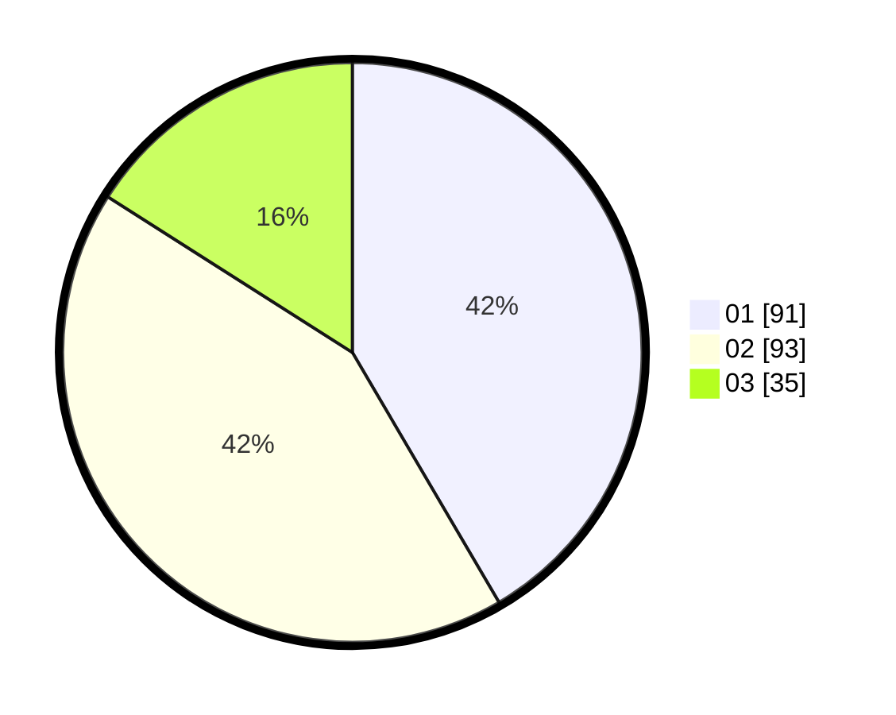

# Hasil

Hasil perolehan suara paslon dapat dilihat pada file paslon-01.txt, paslon-02.txt, dan paslon-03.txt.

Jika tidak ada, artinya data tersebut belum ada pada SIREKAP.

## Perolehan Suara

 * Paslon 01: **91**.
 * Paslon 02: **93**.
 * Paslon 03: **35**.

## Foto C Plano

https://sirekap-obj-formc.kpu.go.id/aeeb/pemilu/ppwp/31/75/08/10/02/3175081002082-20240216-161438--3258dc05-3be7-4b9c-9724-92db242896c6.jpg

https://sirekap-obj-formc.kpu.go.id/aeeb/pemilu/ppwp/31/75/08/10/02/3175081002082-20240216-161439--9e36f0a6-f73b-44d1-a15e-983f76d64e73.jpg

https://sirekap-obj-formc.kpu.go.id/aeeb/pemilu/ppwp/31/75/08/10/02/3175081002082-20240216-161438--f88c410d-bf5c-4e64-85c5-d49290f2c87f.jpg

## DATA PEMILIH TETAP

Jumlah pemilih dalam DPT: **262**.
 * L: **126**.
 * P: **136**.

## DATA PENGGUNA HAK PILIH

Jumlah pengguna hak pilih dalam DPT: **222**.
 * L: **104**.
 * P: **118**.

Jumlah pengguna hak pilih dalam DPTb: **0**.
 * L: **0**.
 * P: **0**.

Jumlah pengguna hak pilih dalam DPK: **1**.
 * L: **1**.
 * P: **0**.

Jumlah pengguna hak pilih: **223**.
 * L: **105**.
 * P: **118**.

## JUMLAH SUARA SAH DAN TIDAK SAH

JUMLAH SELURUH SUARA SAH: **219**.

JUMLAH SUARA TIDAK SAH: **4**.

JUMLAH SELURUH SUARA SAH DAN SUARA TIDAK SAH: **223**.
