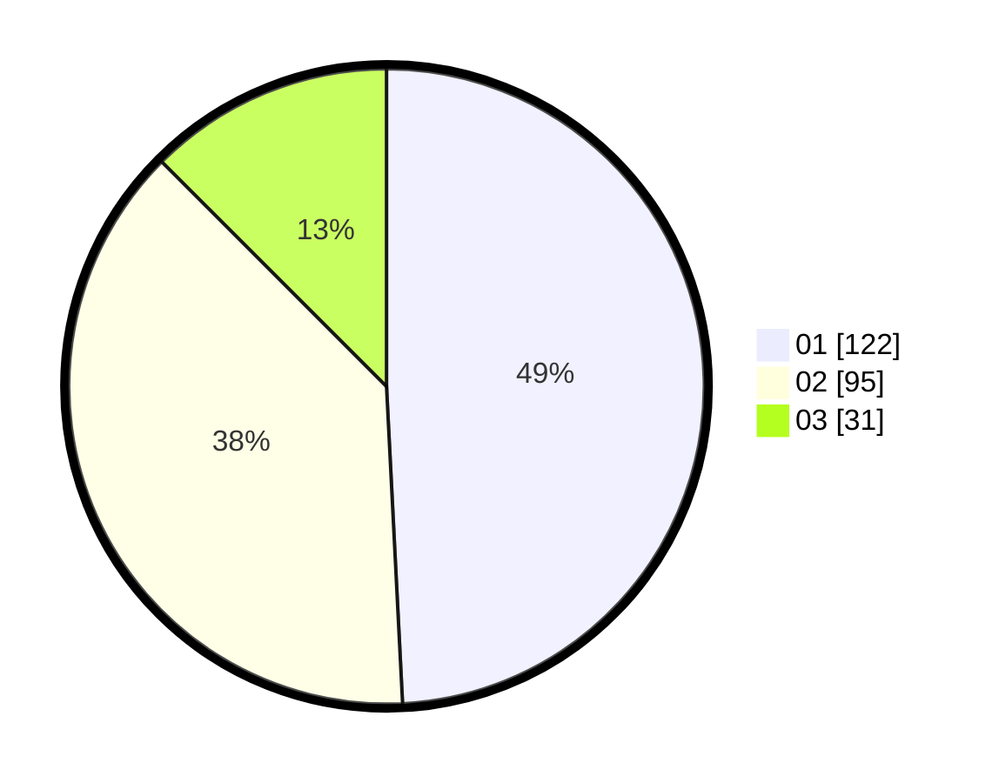

# Hasil

Hasil perolehan suara paslon dapat dilihat pada file paslon-01.txt, paslon-02.txt, dan paslon-03.txt.

Jika tidak ada, artinya data tersebut belum ada pada SIREKAP.

## Perolehan Suara

 * Paslon 01: **122**.
 * Paslon 02: **95**.
 * Paslon 03: **31**.

## Foto C Plano

https://sirekap-obj-formc.kpu.go.id/a578/pemilu/ppwp/31/75/08/10/02/3175081002086-20240216-193944--e5e85476-64d0-4deb-be47-ecc9ce2b0688.jpg

https://sirekap-obj-formc.kpu.go.id/a578/pemilu/ppwp/31/75/08/10/02/3175081002086-20240216-193946--eb5452ce-6438-45a2-81f2-0171ef6e0586.jpg

https://sirekap-obj-formc.kpu.go.id/a578/pemilu/ppwp/31/75/08/10/02/3175081002086-20240216-193945--a7f31d0e-76e3-4021-8930-f9db83a099b6.jpg

## DATA PEMILIH TETAP

Jumlah pemilih dalam DPT: **274**.
 * L: **136**.
 * P: **138**.

## DATA PENGGUNA HAK PILIH

Jumlah pengguna hak pilih dalam DPT: **250**.
 * L: **125**.
 * P: **125**.

Jumlah pengguna hak pilih dalam DPTb: **0**.
 * L: **0**.
 * P: **0**.

Jumlah pengguna hak pilih dalam DPK: **2**.
 * L: **1**.
 * P: **1**.

Jumlah pengguna hak pilih: **252**.
 * L: **126**.
 * P: **126**.

## JUMLAH SUARA SAH DAN TIDAK SAH

JUMLAH SELURUH SUARA SAH: **248**.

JUMLAH SUARA TIDAK SAH: **4**.

JUMLAH SELURUH SUARA SAH DAN SUARA TIDAK SAH: **252**.
