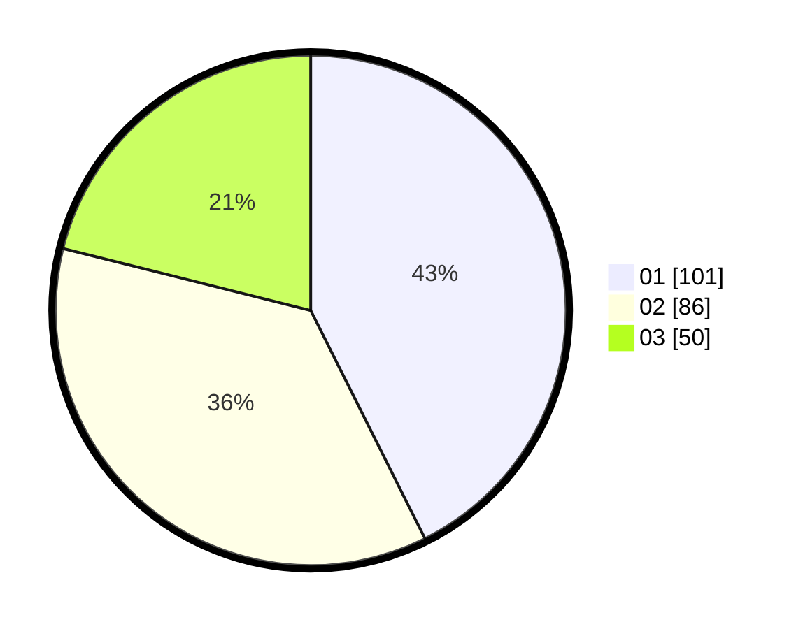

# Hasil

Hasil perolehan suara paslon dapat dilihat pada file paslon-01.txt, paslon-02.txt, dan paslon-03.txt.

Jika tidak ada, artinya data tersebut belum ada pada SIREKAP.

## Perolehan Suara

 * Paslon 01: **101**.
 * Paslon 02: **86**.
 * Paslon 03: **50**.

## Foto C Plano

https://sirekap-obj-formc.kpu.go.id/26f8/pemilu/ppwp/31/75/08/10/02/3175081002087-20240214-193739--452af77b-9ee8-400d-8c38-2d08bfd633cf.jpg

https://sirekap-obj-formc.kpu.go.id/26f8/pemilu/ppwp/31/75/08/10/02/3175081002087-20240214-155412--aedda90a-cdfd-4876-a032-a4e5ec87367a.jpg

https://sirekap-obj-formc.kpu.go.id/26f8/pemilu/ppwp/31/75/08/10/02/3175081002087-20240214-155552--b3919eaa-9096-404f-8440-7faa8a63ec88.jpg

## DATA PEMILIH TETAP

Jumlah pemilih dalam DPT: **274**.
 * L: **124**.
 * P: **150**.

## DATA PENGGUNA HAK PILIH

Jumlah pengguna hak pilih dalam DPT: **232**.
 * L: **99**.
 * P: **133**.

Jumlah pengguna hak pilih dalam DPTb: **1**.
 * L: **1**.
 * P: **0**.

Jumlah pengguna hak pilih dalam DPK: **4**.
 * L: **3**.
 * P: **1**.

Jumlah pengguna hak pilih: **243**.
 * L: **103**.
 * P: **140**.

## JUMLAH SUARA SAH DAN TIDAK SAH

JUMLAH SELURUH SUARA SAH: **237**.

JUMLAH SUARA TIDAK SAH: **1**.

JUMLAH SELURUH SUARA SAH DAN SUARA TIDAK SAH: **238**.
