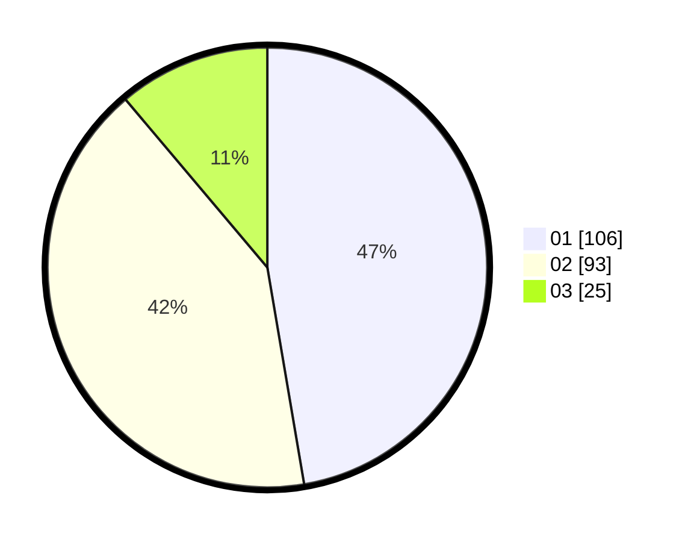

# Hasil

Hasil perolehan suara paslon dapat dilihat pada file paslon-01.txt, paslon-02.txt, dan paslon-03.txt.

Jika tidak ada, artinya data tersebut belum ada pada SIREKAP.

## Perolehan Suara

 * Paslon 01: **106**.
 * Paslon 02: **93**.
 * Paslon 03: **25**.

## Foto C Plano

https://sirekap-obj-formc.kpu.go.id/27db/pemilu/ppwp/31/75/08/10/02/3175081002090-20240214-160057--70684891-d212-4d6f-b6cd-38a12df790f0.jpg

https://sirekap-obj-formc.kpu.go.id/27db/pemilu/ppwp/31/75/08/10/02/3175081002090-20240214-141757--89f249f2-add0-4a0b-aa7a-f4278ce937ba.jpg

https://sirekap-obj-formc.kpu.go.id/27db/pemilu/ppwp/31/75/08/10/02/3175081002090-20240214-141859--9697fb7a-8282-4af9-9a07-810478502dbc.jpg

## DATA PEMILIH TETAP

Jumlah pemilih dalam DPT: **276**.
 * L: **138**.
 * P: **138**.

## DATA PENGGUNA HAK PILIH

Jumlah pengguna hak pilih dalam DPT: **229**.
 * L: **113**.
 * P: **116**.

Jumlah pengguna hak pilih dalam DPTb: **0**.
 * L: **0**.
 * P: **0**.

Jumlah pengguna hak pilih dalam DPK: **0**.
 * L: **0**.
 * P: **0**.

Jumlah pengguna hak pilih: **229**.
 * L: **113**.
 * P: **116**.

## JUMLAH SUARA SAH DAN TIDAK SAH

JUMLAH SELURUH SUARA SAH: **224**.

JUMLAH SUARA TIDAK SAH: **5**.

JUMLAH SELURUH SUARA SAH DAN SUARA TIDAK SAH: **229**.
