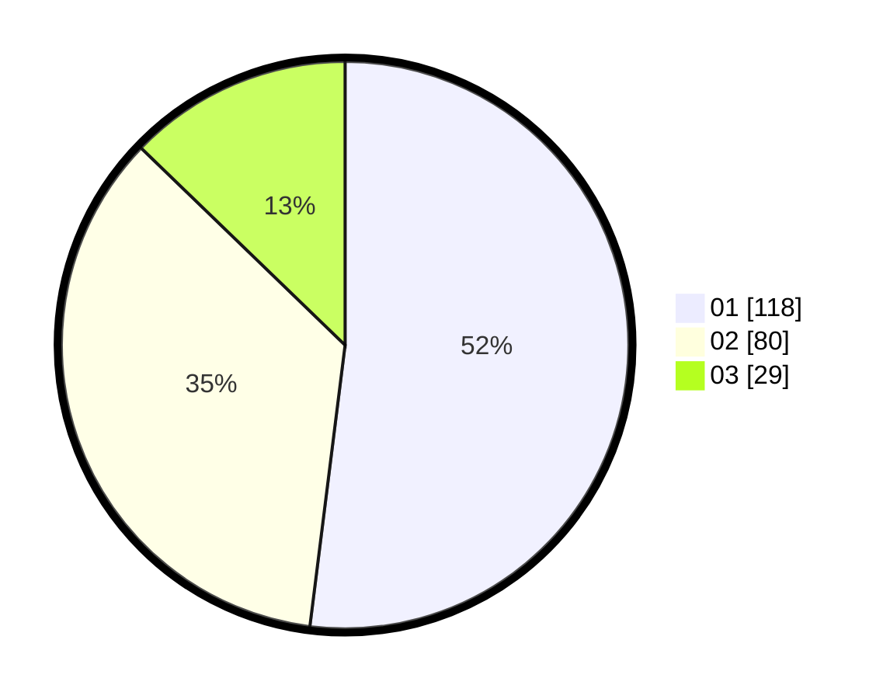

# Hasil

Hasil perolehan suara paslon dapat dilihat pada file paslon-01.txt, paslon-02.txt, dan paslon-03.txt.

Jika tidak ada, artinya data tersebut belum ada pada SIREKAP.

## Perolehan Suara

 * Paslon 01: **118**.
 * Paslon 02: **80**.
 * Paslon 03: **29**.

## Foto C Plano

https://sirekap-obj-formc.kpu.go.id/0b12/pemilu/ppwp/31/75/08/10/02/3175081002091-20240216-092507--4966649a-ad25-498b-a846-d1a52d3c17d2.jpg

https://sirekap-obj-formc.kpu.go.id/0b12/pemilu/ppwp/31/75/08/10/02/3175081002091-20240216-092510--8c58febb-b2fe-4629-a464-281ee6600821.jpg

https://sirekap-obj-formc.kpu.go.id/0b12/pemilu/ppwp/31/75/08/10/02/3175081002091-20240216-092509--c9940a08-d87e-4f2d-81c5-28307d53c82b.jpg

## DATA PEMILIH TETAP

Jumlah pemilih dalam DPT: **269**.
 * L: **134**.
 * P: **135**.

## DATA PENGGUNA HAK PILIH

Jumlah pengguna hak pilih dalam DPT: **229**.
 * L: **109**.
 * P: **120**.

Jumlah pengguna hak pilih dalam DPTb: **1**.
 * L: **0**.
 * P: **1**.

Jumlah pengguna hak pilih dalam DPK: **0**.
 * L: **0**.
 * P: **0**.

Jumlah pengguna hak pilih: **230**.
 * L: **109**.
 * P: **121**.

## JUMLAH SUARA SAH DAN TIDAK SAH

JUMLAH SELURUH SUARA SAH: **227**.

JUMLAH SUARA TIDAK SAH: **3**.

JUMLAH SELURUH SUARA SAH DAN SUARA TIDAK SAH: **230**.
