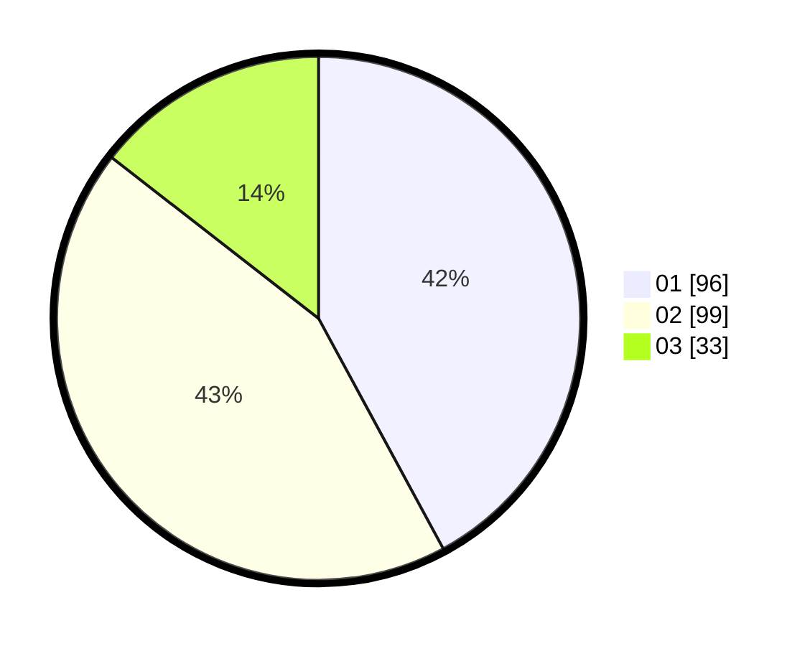

# Hasil

Hasil perolehan suara paslon dapat dilihat pada file paslon-01.txt, paslon-02.txt, dan paslon-03.txt.

Jika tidak ada, artinya data tersebut belum ada pada SIREKAP.

## Perolehan Suara

 * Paslon 01: **96**.
 * Paslon 02: **99**.
 * Paslon 03: **33**.

## Foto C Plano

https://sirekap-obj-formc.kpu.go.id/a1ba/pemilu/ppwp/31/75/08/10/02/3175081002092-20240214-195556--b635da05-3849-47e5-9b21-755ff5bae99c.jpg

https://sirekap-obj-formc.kpu.go.id/a1ba/pemilu/ppwp/31/75/08/10/02/3175081002092-20240214-223121--fe0b8169-83c4-426c-89b5-f276dfa57cf6.jpg

https://sirekap-obj-formc.kpu.go.id/a1ba/pemilu/ppwp/31/75/08/10/02/3175081002092-20240214-195849--defa3ce7-c4fb-4041-9f5c-0fa2dacee570.jpg

## DATA PEMILIH TETAP

Jumlah pemilih dalam DPT: **285**.
 * L: **136**.
 * P: **149**.

## DATA PENGGUNA HAK PILIH

Jumlah pengguna hak pilih dalam DPT: **230**.
 * L: **114**.
 * P: **116**.

Jumlah pengguna hak pilih dalam DPTb: **0**.
 * L: **0**.
 * P: **0**.

Jumlah pengguna hak pilih dalam DPK: **0**.
 * L: **0**.
 * P: **0**.

Jumlah pengguna hak pilih: **230**.
 * L: **114**.
 * P: **116**.

## JUMLAH SUARA SAH DAN TIDAK SAH

JUMLAH SELURUH SUARA SAH: **228**.

JUMLAH SUARA TIDAK SAH: **2**.

JUMLAH SELURUH SUARA SAH DAN SUARA TIDAK SAH: **230**.
