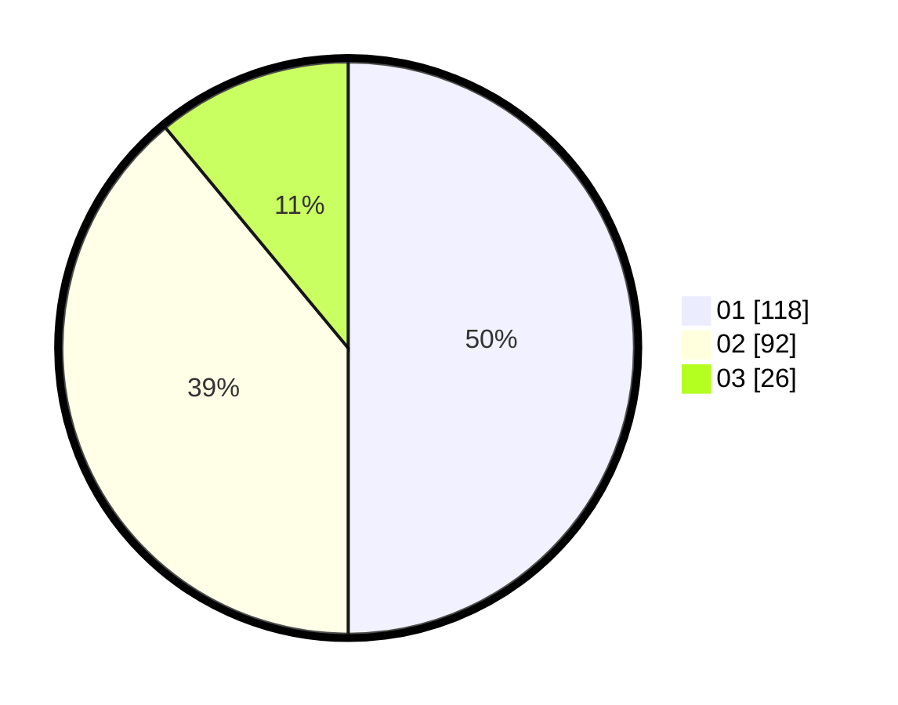

# Hasil

Hasil perolehan suara paslon dapat dilihat pada file paslon-01.txt, paslon-02.txt, dan paslon-03.txt.

Jika tidak ada, artinya data tersebut belum ada pada SIREKAP.

## Perolehan Suara

 * Paslon 01: **118**.
 * Paslon 02: **92**.
 * Paslon 03: **26**.

## Foto C Plano

https://sirekap-obj-formc.kpu.go.id/7799/pemilu/ppwp/31/75/08/10/02/3175081002093-20240214-224801--217258aa-fd85-422a-ab1f-79534258b75c.jpg

https://sirekap-obj-formc.kpu.go.id/7799/pemilu/ppwp/31/75/08/10/02/3175081002093-20240214-225015--fd355934-b56e-4a27-ac8a-d49aaadac7ef.jpg

https://sirekap-obj-formc.kpu.go.id/7799/pemilu/ppwp/31/75/08/10/02/3175081002093-20240214-225136--39de7a91-dd75-4273-9676-304f42df9992.jpg
