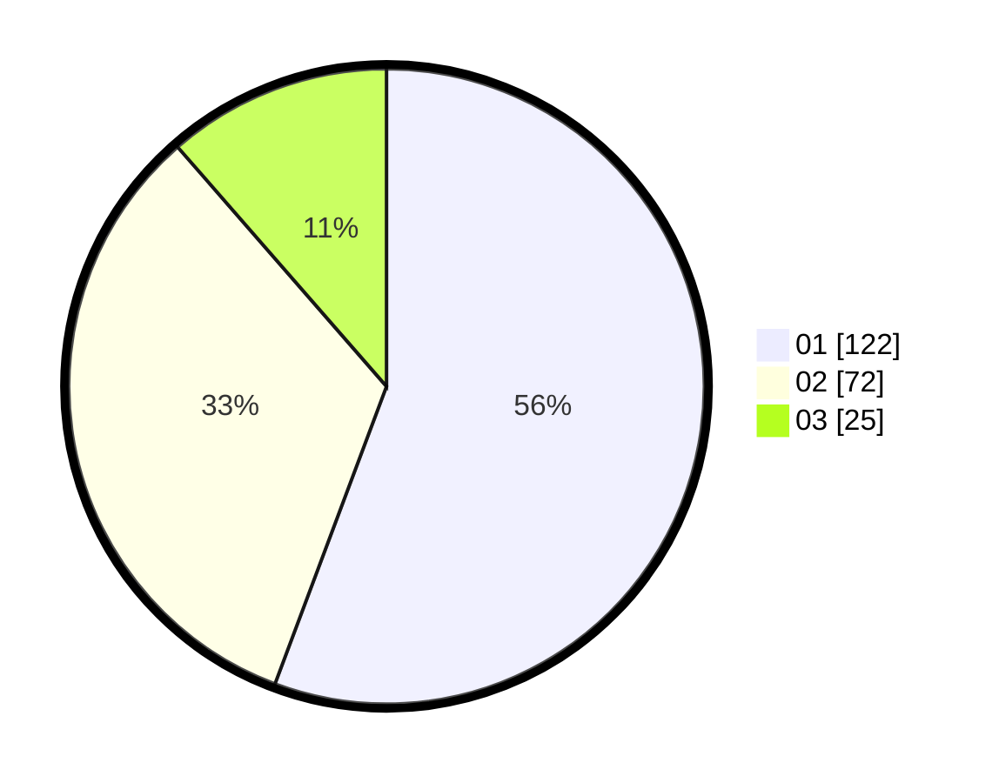

# Hasil

Hasil perolehan suara paslon dapat dilihat pada file paslon-01.txt, paslon-02.txt, dan paslon-03.txt.

Jika tidak ada, artinya data tersebut belum ada pada SIREKAP.

## Perolehan Suara

 * Paslon 01: **122**.
 * Paslon 02: **72**.
 * Paslon 03: **25**.

## Foto C Plano

https://sirekap-obj-formc.kpu.go.id/98e7/pemilu/ppwp/31/75/08/10/02/3175081002094-20240214-192544--58035946-f3eb-4f15-981e-26b12fef2030.jpg

https://sirekap-obj-formc.kpu.go.id/98e7/pemilu/ppwp/31/75/08/10/02/3175081002094-20240214-192558--99658daa-9147-42b2-be3a-fe7a31cbe100.jpg

https://sirekap-obj-formc.kpu.go.id/98e7/pemilu/ppwp/31/75/08/10/02/3175081002094-20240215-020510--028d5e19-7368-407d-b8c0-3440c756f7b3.jpg
