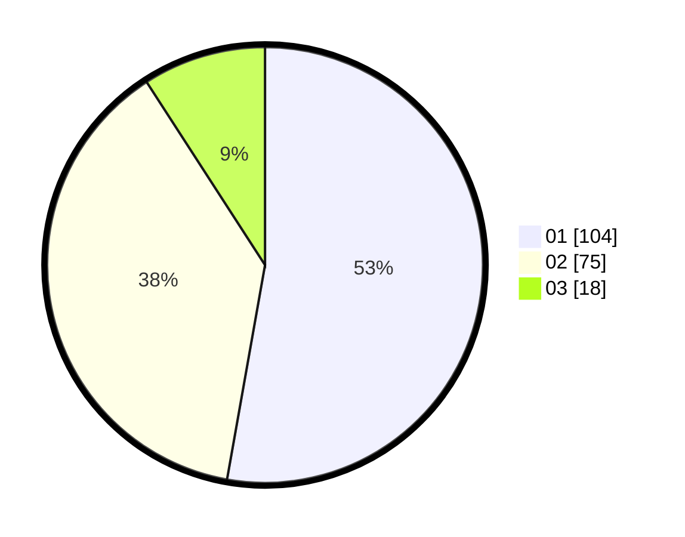

# Hasil

Hasil perolehan suara paslon dapat dilihat pada file paslon-01.txt, paslon-02.txt, dan paslon-03.txt.

Jika tidak ada, artinya data tersebut belum ada pada SIREKAP.

## Perolehan Suara

 * Paslon 01: **104**.
 * Paslon 02: **75**.
 * Paslon 03: **18**.

## Foto C Plano

https://sirekap-obj-formc.kpu.go.id/3d38/pemilu/ppwp/31/75/08/10/03/3175081003001-20240214-205400--9961383d-ad8f-4e5d-ba46-c0c54b2e8851.jpg

https://sirekap-obj-formc.kpu.go.id/3d38/pemilu/ppwp/31/75/08/10/03/3175081003001-20240214-205036--ebcf567e-263c-4091-b0ff-b96526cdf2ac.jpg

https://sirekap-obj-formc.kpu.go.id/3d38/pemilu/ppwp/31/75/08/10/03/3175081003001-20240214-203054--26a1ce19-f6ca-4db1-8b8c-80d098437d58.jpg
