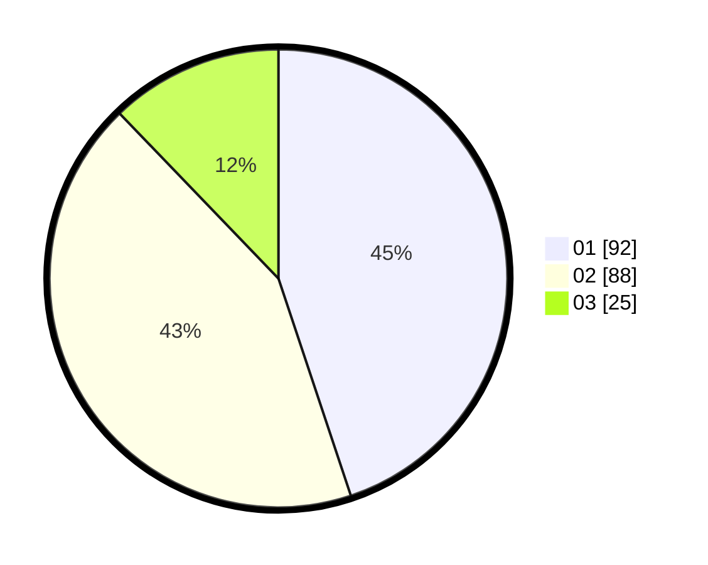

# Hasil

Hasil perolehan suara paslon dapat dilihat pada file paslon-01.txt, paslon-02.txt, dan paslon-03.txt.

Jika tidak ada, artinya data tersebut belum ada pada SIREKAP.

## Perolehan Suara

 * Paslon 01: **92**.
 * Paslon 02: **88**.
 * Paslon 03: **25**.

## Foto C Plano

https://sirekap-obj-formc.kpu.go.id/cc4a/pemilu/ppwp/31/75/08/10/03/3175081003004-20240215-003549--b387b83a-cbbb-4115-98dd-9b2282245616.jpg

https://sirekap-obj-formc.kpu.go.id/cc4a/pemilu/ppwp/31/75/08/10/03/3175081003004-20240215-003701--366f61e3-fb88-4723-9a6a-b104178900b3.jpg

https://sirekap-obj-formc.kpu.go.id/cc4a/pemilu/ppwp/31/75/08/10/03/3175081003004-20240215-003755--df2fdc29-59ca-4cff-827f-9336cee6eca9.jpg
