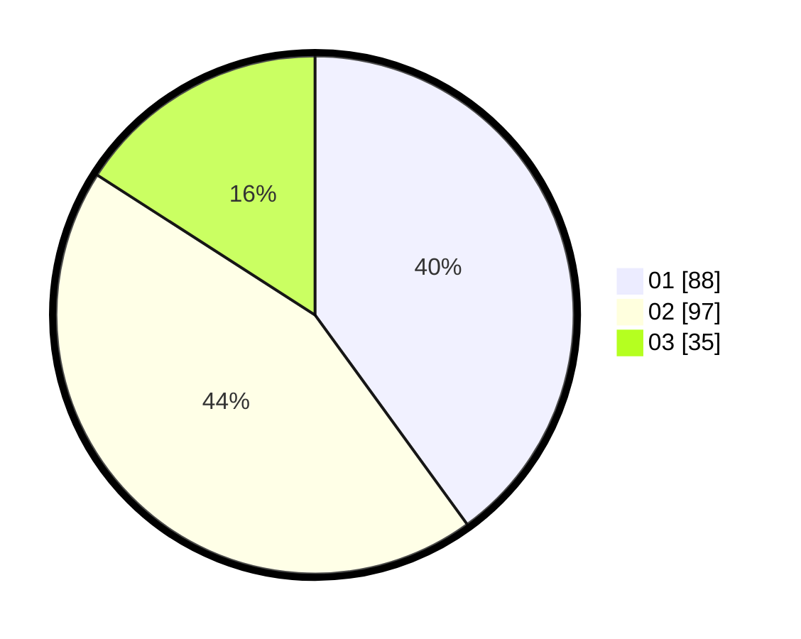

# Hasil

Hasil perolehan suara paslon dapat dilihat pada file paslon-01.txt, paslon-02.txt, dan paslon-03.txt.

Jika tidak ada, artinya data tersebut belum ada pada SIREKAP.

## Perolehan Suara

 * Paslon 01: **88**.
 * Paslon 02: **97**.
 * Paslon 03: **35**.

## Foto C Plano

https://sirekap-obj-formc.kpu.go.id/905b/pemilu/ppwp/31/75/08/10/03/3175081003005-20240214-193729--3b39a594-eddd-4077-8a58-aa2cc255b889.jpg

https://sirekap-obj-formc.kpu.go.id/905b/pemilu/ppwp/31/75/08/10/03/3175081003005-20240215-012007--2537e777-7f7c-451f-bbb8-acc8b8b5cec9.jpg
