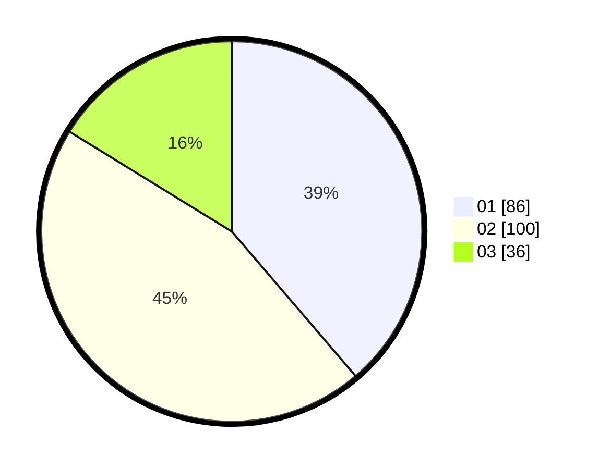

# Hasil

Hasil perolehan suara paslon dapat dilihat pada file paslon-01.txt, paslon-02.txt, dan paslon-03.txt.

Jika tidak ada, artinya data tersebut belum ada pada SIREKAP.

## Perolehan Suara

 * Paslon 01: **86**.
 * Paslon 02: **100**.
 * Paslon 03: **36**.

## Foto C Plano

https://sirekap-obj-formc.kpu.go.id/684c/pemilu/ppwp/31/75/08/10/03/3175081003010-20240215-002108--32a2ed37-a955-4dc3-bb87-bd32aced4152.jpg

https://sirekap-obj-formc.kpu.go.id/684c/pemilu/ppwp/31/75/08/10/03/3175081003010-20240214-201150--9ff742d9-b5a9-4223-890c-253221a495ac.jpg
