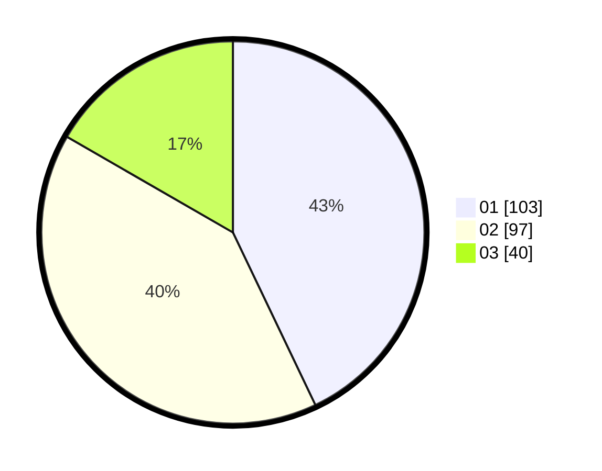

# Hasil

Hasil perolehan suara paslon dapat dilihat pada file paslon-01.txt, paslon-02.txt, dan paslon-03.txt.

Jika tidak ada, artinya data tersebut belum ada pada SIREKAP.

## Perolehan Suara

 * Paslon 01: **103**.
 * Paslon 02: **97**.
 * Paslon 03: **40**.

## Foto C Plano

https://sirekap-obj-formc.kpu.go.id/a2e6/pemilu/ppwp/31/75/08/10/03/3175081003011-20240214-203337--bcd052be-4203-4923-9bb0-0fddf76afaaf.jpg

https://sirekap-obj-formc.kpu.go.id/a2e6/pemilu/ppwp/31/75/08/10/03/3175081003011-20240214-214722--33a3dab4-1a17-4c28-a390-c7ee113acdd8.jpg

https://sirekap-obj-formc.kpu.go.id/a2e6/pemilu/ppwp/31/75/08/10/03/3175081003011-20240214-214351--fc1fa96c-3e60-44e4-aef8-d0229fa81dbe.jpg
