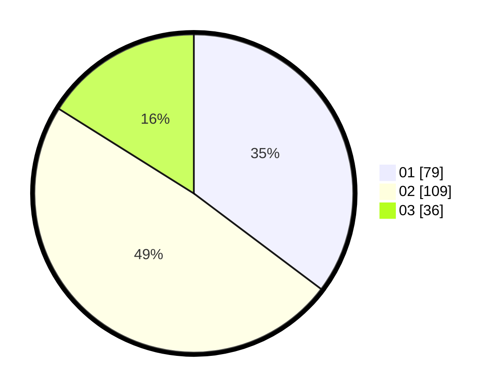

# Hasil

Hasil perolehan suara paslon dapat dilihat pada file paslon-01.txt, paslon-02.txt, dan paslon-03.txt.

Jika tidak ada, artinya data tersebut belum ada pada SIREKAP.

## Perolehan Suara

 * Paslon 01: **79**.
 * Paslon 02: **109**.
 * Paslon 03: **36**.

## Foto C Plano

https://sirekap-obj-formc.kpu.go.id/c86d/pemilu/ppwp/31/75/08/10/03/3175081003015-20240214-220526--25ef43db-2332-447b-bc4c-2a84cad04c8c.jpg

https://sirekap-obj-formc.kpu.go.id/c86d/pemilu/ppwp/31/75/08/10/03/3175081003015-20240214-211931--1b0031be-2991-4754-be72-1a7a8fa9834d.jpg

https://sirekap-obj-formc.kpu.go.id/c86d/pemilu/ppwp/31/75/08/10/03/3175081003015-20240214-212337--fa0b5db8-7e75-467c-8a4c-5980ff7cbcfc.jpg
