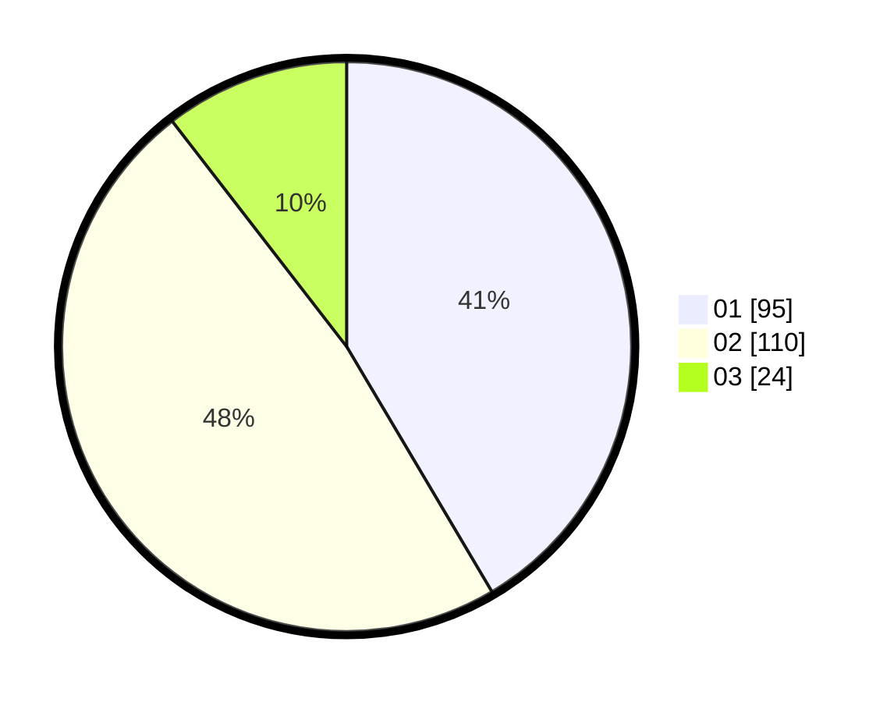

# Hasil

Hasil perolehan suara paslon dapat dilihat pada file paslon-01.txt, paslon-02.txt, dan paslon-03.txt.

Jika tidak ada, artinya data tersebut belum ada pada SIREKAP.

## Perolehan Suara

 * Paslon 01: **95**.
 * Paslon 02: **110**.
 * Paslon 03: **24**.

## Foto C Plano

https://sirekap-obj-formc.kpu.go.id/598c/pemilu/ppwp/31/75/08/10/03/3175081003020-20240214-223928--3df5b2ca-ccda-4b92-ab47-c5dbef5fe1e3.jpg

https://sirekap-obj-formc.kpu.go.id/598c/pemilu/ppwp/31/75/08/10/03/3175081003020-20240214-224035--56e2b121-b25c-400f-8035-e5467444da15.jpg

https://sirekap-obj-formc.kpu.go.id/598c/pemilu/ppwp/31/75/08/10/03/3175081003020-20240214-224634--ccadaaf2-0462-4c27-a888-49c87d375079.jpg
