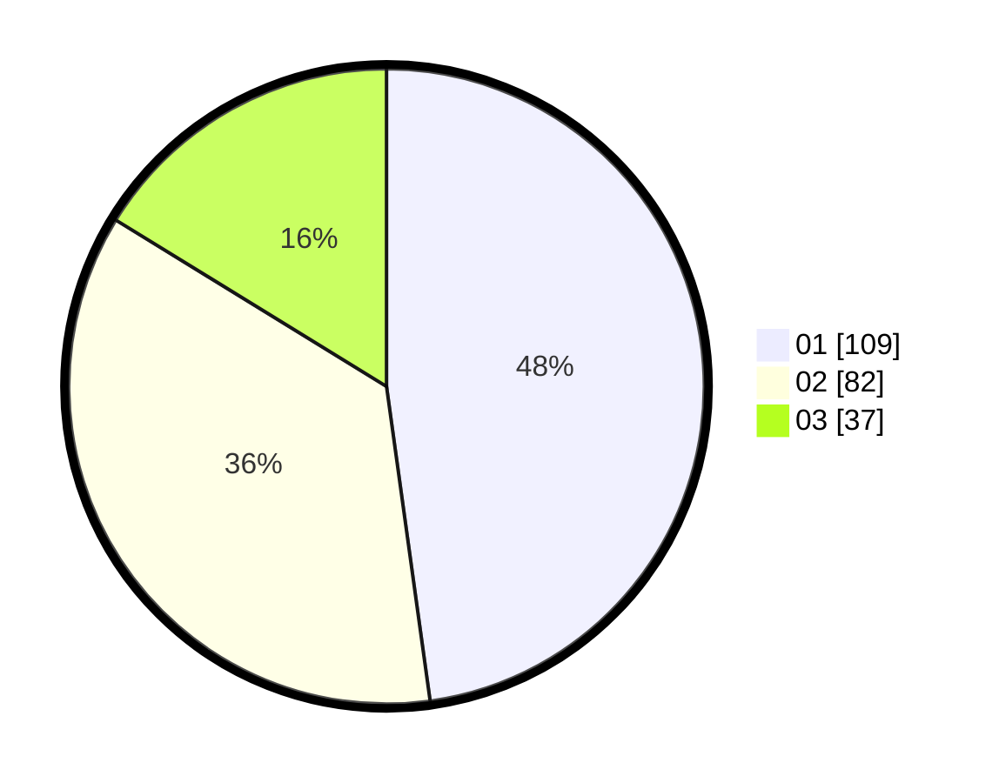

# Hasil

Hasil perolehan suara paslon dapat dilihat pada file paslon-01.txt, paslon-02.txt, dan paslon-03.txt.

Jika tidak ada, artinya data tersebut belum ada pada SIREKAP.

## Perolehan Suara

 * Paslon 01: **109**.
 * Paslon 02: **82**.
 * Paslon 03: **37**.

## Foto C Plano

https://sirekap-obj-formc.kpu.go.id/31fb/pemilu/ppwp/31/75/08/10/03/3175081003021-20240216-061557--388c7c9c-d803-47e6-ac5d-cd26135d6c51.jpg

https://sirekap-obj-formc.kpu.go.id/31fb/pemilu/ppwp/31/75/08/10/03/3175081003021-20240216-061611--b279ee49-1f2e-4e24-af97-18d9999b9152.jpg

https://sirekap-obj-formc.kpu.go.id/31fb/pemilu/ppwp/31/75/08/10/03/3175081003021-20240216-061604--ea8b5fcd-0b67-4c5f-918c-a1c4867c448d.jpg

## DATA PEMILIH TETAP

Jumlah pemilih dalam DPT: **263**.
 * L: **122**.
 * P: **141**.

## DATA PENGGUNA HAK PILIH

Jumlah pengguna hak pilih dalam DPT: **231**.
 * L: **104**.
 * P: **127**.

Jumlah pengguna hak pilih dalam DPTb: **0**.
 * L: **0**.
 * P: **0**.

Jumlah pengguna hak pilih dalam DPK: **0**.
 * L: **0**.
 * P: **0**.

Jumlah pengguna hak pilih: **231**.
 * L: **104**.
 * P: **127**.

## JUMLAH SUARA SAH DAN TIDAK SAH

JUMLAH SELURUH SUARA SAH: **228**.

JUMLAH SUARA TIDAK SAH: **3**.

JUMLAH SELURUH SUARA SAH DAN SUARA TIDAK SAH: **231**.
