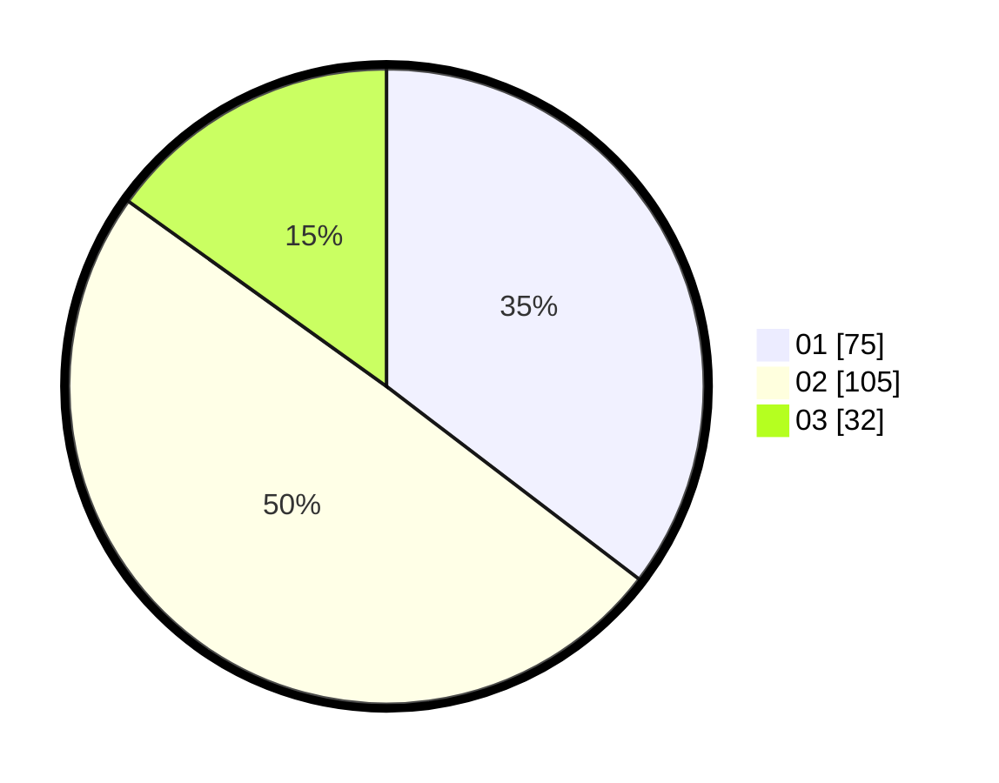

# Hasil

Hasil perolehan suara paslon dapat dilihat pada file paslon-01.txt, paslon-02.txt, dan paslon-03.txt.

Jika tidak ada, artinya data tersebut belum ada pada SIREKAP.

## Perolehan Suara

 * Paslon 01: **75**.
 * Paslon 02: **105**.
 * Paslon 03: **32**.

## Foto C Plano

https://sirekap-obj-formc.kpu.go.id/e34b/pemilu/ppwp/31/75/08/10/03/3175081003024-20240214-204929--0797bafb-b2e0-4b79-b8ff-b1cfbe681ecc.jpg

https://sirekap-obj-formc.kpu.go.id/e34b/pemilu/ppwp/31/75/08/10/03/3175081003024-20240214-204749--87f26780-7bbd-43a1-9b8d-cf9334d50330.jpg
