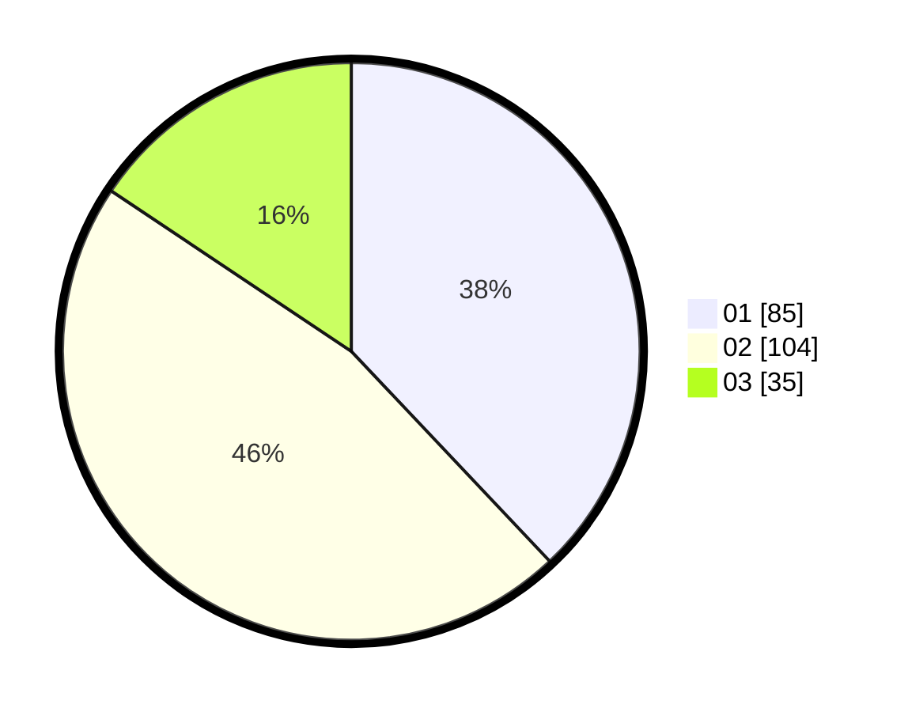

# Hasil

Hasil perolehan suara paslon dapat dilihat pada file paslon-01.txt, paslon-02.txt, dan paslon-03.txt.

Jika tidak ada, artinya data tersebut belum ada pada SIREKAP.

## Perolehan Suara

 * Paslon 01: **85**.
 * Paslon 02: **104**.
 * Paslon 03: **35**.

## Foto C Plano

https://sirekap-obj-formc.kpu.go.id/f90e/pemilu/ppwp/31/75/08/10/03/3175081003027-20240214-155751--09fcc464-ddb7-455d-a087-252f0961c2cf.jpg

https://sirekap-obj-formc.kpu.go.id/f90e/pemilu/ppwp/31/75/08/10/03/3175081003027-20240214-162238--c8b00bfd-f9e4-4e61-a94a-8a4ff348fc13.jpg

https://sirekap-obj-formc.kpu.go.id/f90e/pemilu/ppwp/31/75/08/10/03/3175081003027-20240214-162247--c9aace33-3d44-4f3c-90e9-9913d2bc9aa3.jpg

## DATA PEMILIH TETAP

Jumlah pemilih dalam DPT: **268**.
 * L: **129**.
 * P: **139**.

## DATA PENGGUNA HAK PILIH

Jumlah pengguna hak pilih dalam DPT: **225**.
 * L: **106**.
 * P: **119**.

Jumlah pengguna hak pilih dalam DPTb: **0**.
 * L: **0**.
 * P: **0**.

Jumlah pengguna hak pilih dalam DPK: **1**.
 * L: **1**.
 * P: **0**.

Jumlah pengguna hak pilih: **226**.
 * L: **107**.
 * P: **119**.

## JUMLAH SUARA SAH DAN TIDAK SAH

JUMLAH SELURUH SUARA SAH: **224**.

JUMLAH SUARA TIDAK SAH: **2**.

JUMLAH SELURUH SUARA SAH DAN SUARA TIDAK SAH: **226**.
