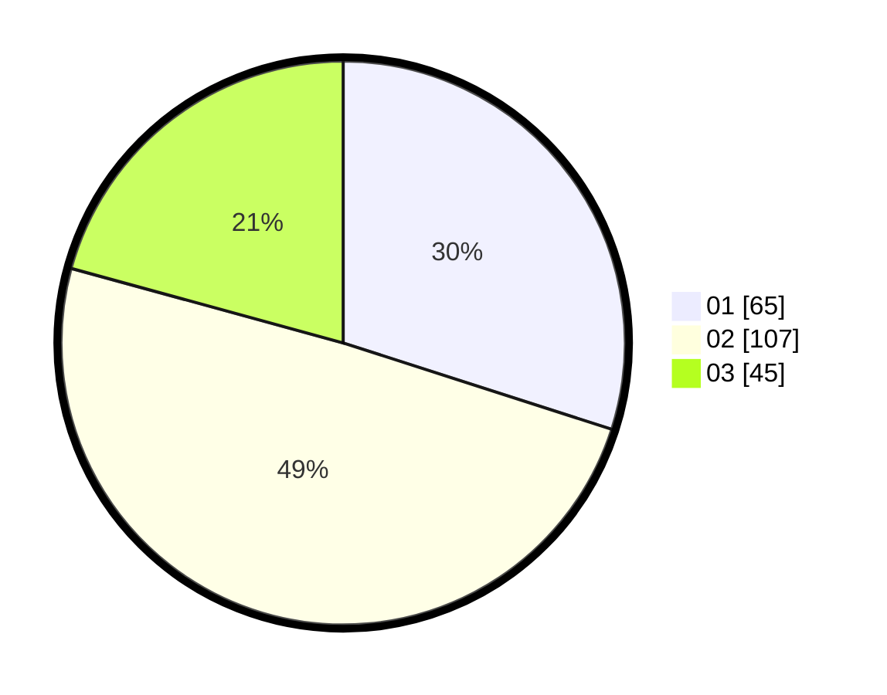

# Hasil

Hasil perolehan suara paslon dapat dilihat pada file paslon-01.txt, paslon-02.txt, dan paslon-03.txt.

Jika tidak ada, artinya data tersebut belum ada pada SIREKAP.

## Perolehan Suara

 * Paslon 01: **65**.
 * Paslon 02: **107**.
 * Paslon 03: **45**.

## Foto C Plano

https://sirekap-obj-formc.kpu.go.id/a18d/pemilu/ppwp/31/75/08/10/03/3175081003029-20240216-175914--41467e2d-dda4-4a90-8809-797f90172ae1.jpg

https://sirekap-obj-formc.kpu.go.id/a18d/pemilu/ppwp/31/75/08/10/03/3175081003029-20240216-175915--d46d4637-38ae-46d3-a401-0e65950e0479.jpg

https://sirekap-obj-formc.kpu.go.id/a18d/pemilu/ppwp/31/75/08/10/03/3175081003029-20240216-175914--e5247466-9815-4fa0-b978-667f3bfdb76e.jpg

## DATA PEMILIH TETAP

Jumlah pemilih dalam DPT: **266**.
 * L: **130**.
 * P: **136**.

## DATA PENGGUNA HAK PILIH

Jumlah pengguna hak pilih dalam DPT: **214**.
 * L: **98**.
 * P: **116**.

Jumlah pengguna hak pilih dalam DPTb: **1**.
 * L: **1**.
 * P: **0**.

Jumlah pengguna hak pilih dalam DPK: **2**.
 * L: **1**.
 * P: **1**.

Jumlah pengguna hak pilih: **217**.
 * L: **100**.
 * P: **117**.

## JUMLAH SUARA SAH DAN TIDAK SAH

JUMLAH SELURUH SUARA SAH: **217**.

JUMLAH SUARA TIDAK SAH: **0**.

JUMLAH SELURUH SUARA SAH DAN SUARA TIDAK SAH: **217**.
