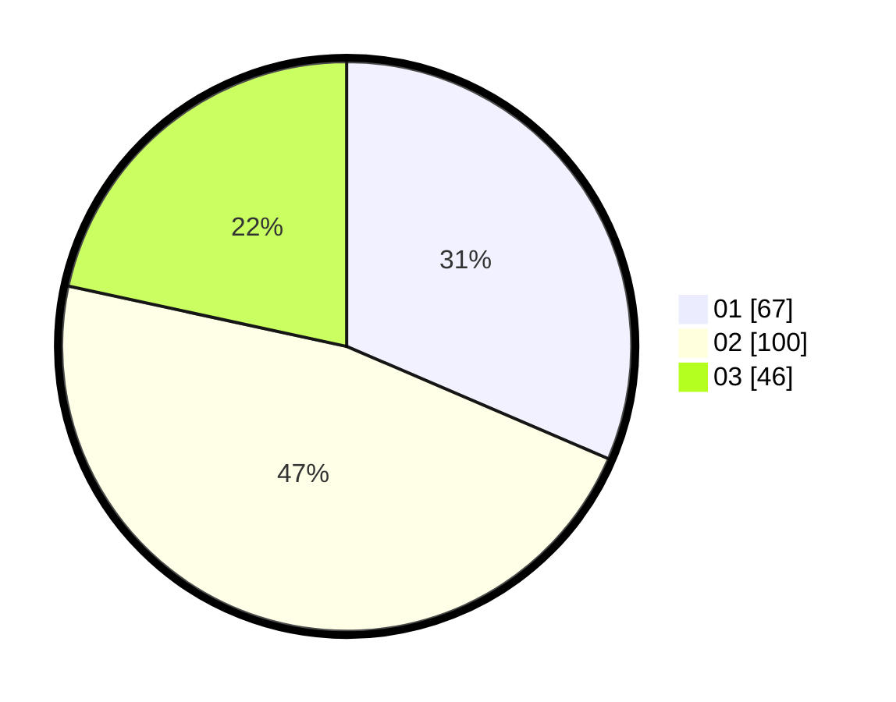

# Hasil

Hasil perolehan suara paslon dapat dilihat pada file paslon-01.txt, paslon-02.txt, dan paslon-03.txt.

Jika tidak ada, artinya data tersebut belum ada pada SIREKAP.

## Perolehan Suara

 * Paslon 01: **67**.
 * Paslon 02: **100**.
 * Paslon 03: **46**.

## Foto C Plano

https://sirekap-obj-formc.kpu.go.id/d334/pemilu/ppwp/31/75/08/10/03/3175081003030-20240215-121437--87a3d480-0869-4f2f-86a8-c1888286d8e5.jpg

https://sirekap-obj-formc.kpu.go.id/d334/pemilu/ppwp/31/75/08/10/03/3175081003030-20240214-223027--7cce72ab-f7c6-4b62-82d7-724bd86739d7.jpg

https://sirekap-obj-formc.kpu.go.id/d334/pemilu/ppwp/31/75/08/10/03/3175081003030-20240214-220013--2fbe513b-f7fc-46cd-ae30-32e34214c94e.jpg
