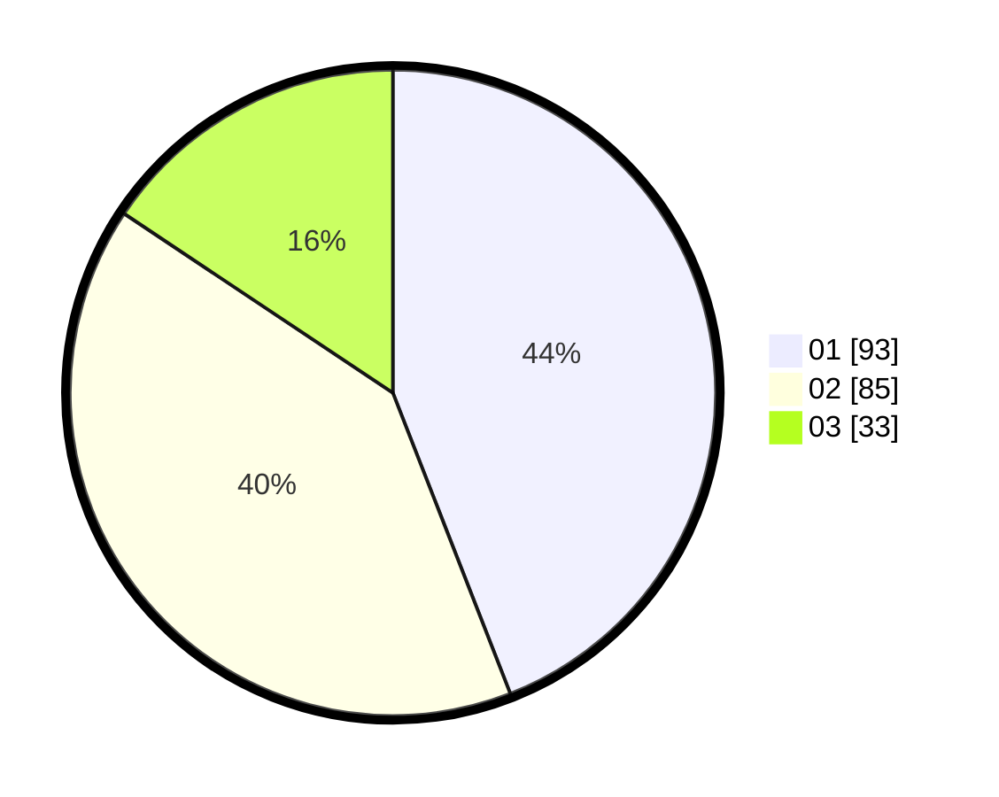

# Hasil

Hasil perolehan suara paslon dapat dilihat pada file paslon-01.txt, paslon-02.txt, dan paslon-03.txt.

Jika tidak ada, artinya data tersebut belum ada pada SIREKAP.

## Perolehan Suara

 * Paslon 01: **93**.
 * Paslon 02: **85**.
 * Paslon 03: **33**.

## Foto C Plano

https://sirekap-obj-formc.kpu.go.id/bafb/pemilu/ppwp/31/75/08/10/03/3175081003032-20240214-204059--248c9655-9b8b-4cb7-8a2d-ec7ba732b33c.jpg

https://sirekap-obj-formc.kpu.go.id/bafb/pemilu/ppwp/31/75/08/10/03/3175081003032-20240214-204131--058ed229-3584-416e-9788-c947e48d6d8e.jpg

https://sirekap-obj-formc.kpu.go.id/bafb/pemilu/ppwp/31/75/08/10/03/3175081003032-20240215-024516--c92c447d-6096-4f38-b690-a069d266fa39.jpg

## DATA PEMILIH TETAP

Jumlah pemilih dalam DPT: **259**.
 * L: **132**.
 * P: **127**.

## DATA PENGGUNA HAK PILIH

Jumlah pengguna hak pilih dalam DPT: **215**.
 * L: **106**.
 * P: **109**.

Jumlah pengguna hak pilih dalam DPTb: **0**.
 * L: **0**.
 * P: **0**.

Jumlah pengguna hak pilih dalam DPK: **0**.
 * L: **0**.
 * P: **0**.

Jumlah pengguna hak pilih: **215**.
 * L: **106**.
 * P: **109**.

## JUMLAH SUARA SAH DAN TIDAK SAH

JUMLAH SELURUH SUARA SAH: **211**.

JUMLAH SUARA TIDAK SAH: **4**.

JUMLAH SELURUH SUARA SAH DAN SUARA TIDAK SAH: **215**.
