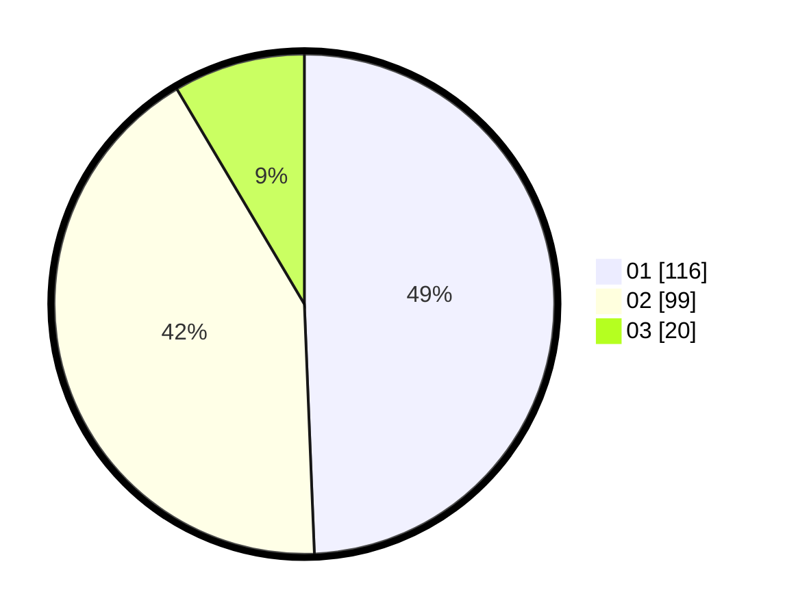

# Hasil

Hasil perolehan suara paslon dapat dilihat pada file paslon-01.txt, paslon-02.txt, dan paslon-03.txt.

Jika tidak ada, artinya data tersebut belum ada pada SIREKAP.

## Perolehan Suara

 * Paslon 01: **116**.
 * Paslon 02: **99**.
 * Paslon 03: **20**.

## Foto C Plano

https://sirekap-obj-formc.kpu.go.id/7728/pemilu/ppwp/31/75/08/10/03/3175081003042-20240214-155451--aca58a8a-b42a-4df6-9419-283e330fc2a7.jpg

https://sirekap-obj-formc.kpu.go.id/7728/pemilu/ppwp/31/75/08/10/03/3175081003042-20240214-160104--30ec984d-3581-40cb-8eb5-d4544747e572.jpg

https://sirekap-obj-formc.kpu.go.id/7728/pemilu/ppwp/31/75/08/10/03/3175081003042-20240216-075525--0690b905-b4ef-4253-8fab-6caf5d8bda7b.jpg

## DATA PEMILIH TETAP

Jumlah pemilih dalam DPT: **273**.
 * L: **139**.
 * P: **134**.

## DATA PENGGUNA HAK PILIH

Jumlah pengguna hak pilih dalam DPT: **234**.
 * L: **123**.
 * P: **111**.

Jumlah pengguna hak pilih dalam DPTb: **3**.
 * L: **2**.
 * P: **1**.

Jumlah pengguna hak pilih dalam DPK: **0**.
 * L: **0**.
 * P: **0**.

Jumlah pengguna hak pilih: **237**.
 * L: **125**.
 * P: **112**.

## JUMLAH SUARA SAH DAN TIDAK SAH

JUMLAH SELURUH SUARA SAH: **235**.

JUMLAH SUARA TIDAK SAH: **2**.

JUMLAH SELURUH SUARA SAH DAN SUARA TIDAK SAH: **237**.
