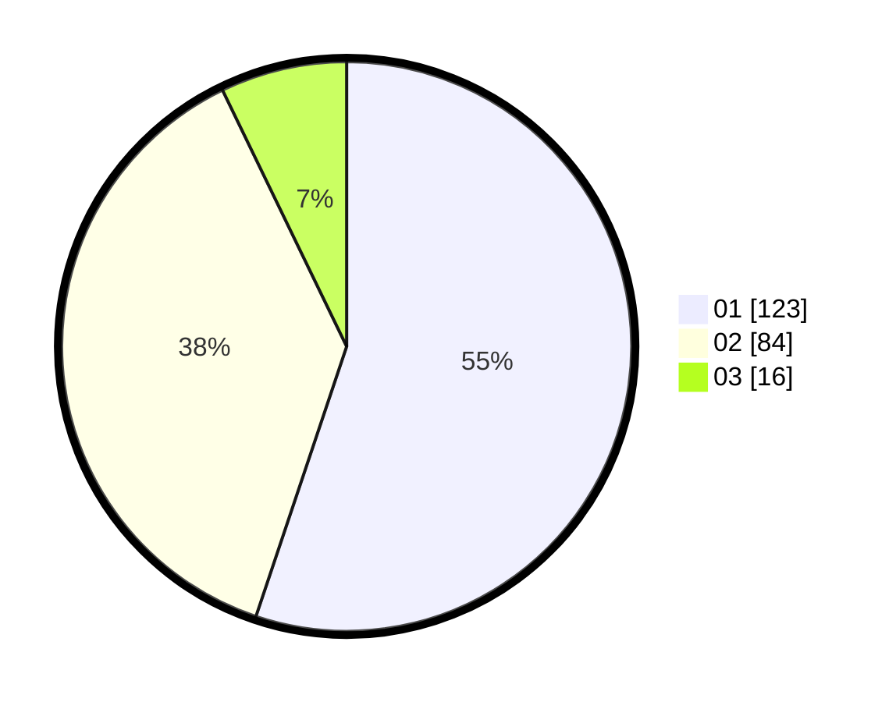

# Hasil

Hasil perolehan suara paslon dapat dilihat pada file paslon-01.txt, paslon-02.txt, dan paslon-03.txt.

Jika tidak ada, artinya data tersebut belum ada pada SIREKAP.

## Perolehan Suara

 * Paslon 01: **123**.
 * Paslon 02: **84**.
 * Paslon 03: **16**.

## Foto C Plano

https://sirekap-obj-formc.kpu.go.id/9b7a/pemilu/ppwp/31/75/08/10/03/3175081003047-20240215-021932--ba168e02-e5f2-47fb-817f-4531a152ae55.jpg

https://sirekap-obj-formc.kpu.go.id/9b7a/pemilu/ppwp/31/75/08/10/03/3175081003047-20240215-021935--f660b3b6-fb14-4806-9fc5-bb60b14e3c6a.jpg

https://sirekap-obj-formc.kpu.go.id/9b7a/pemilu/ppwp/31/75/08/10/03/3175081003047-20240215-021937--c018e035-c240-459e-9ce8-5907e8a8dce6.jpg
