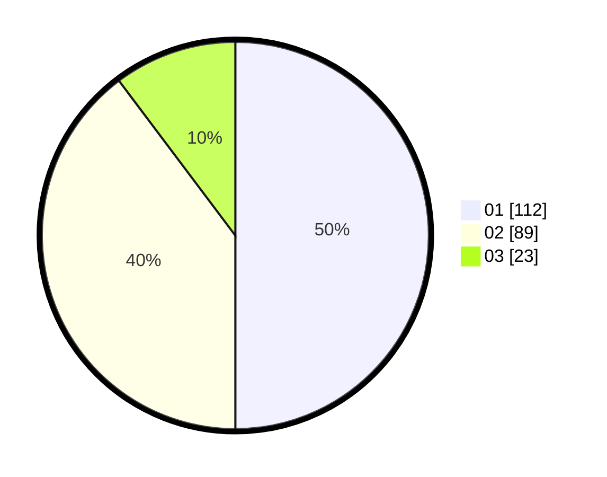

# Hasil

Hasil perolehan suara paslon dapat dilihat pada file paslon-01.txt, paslon-02.txt, dan paslon-03.txt.

Jika tidak ada, artinya data tersebut belum ada pada SIREKAP.

## Perolehan Suara

 * Paslon 01: **112**.
 * Paslon 02: **89**.
 * Paslon 03: **23**.

## Foto C Plano

https://sirekap-obj-formc.kpu.go.id/f61a/pemilu/ppwp/31/75/08/10/03/3175081003049-20240215-070920--9994d5c7-4175-4219-b051-6488d3156cb6.jpg

https://sirekap-obj-formc.kpu.go.id/f61a/pemilu/ppwp/31/75/08/10/03/3175081003049-20240215-071229--65917fb4-9341-4ddf-83ae-3b2d032ade62.jpg

https://sirekap-obj-formc.kpu.go.id/f61a/pemilu/ppwp/31/75/08/10/03/3175081003049-20240215-071405--3407f4f2-10df-425c-ade6-066175fb09ac.jpg
