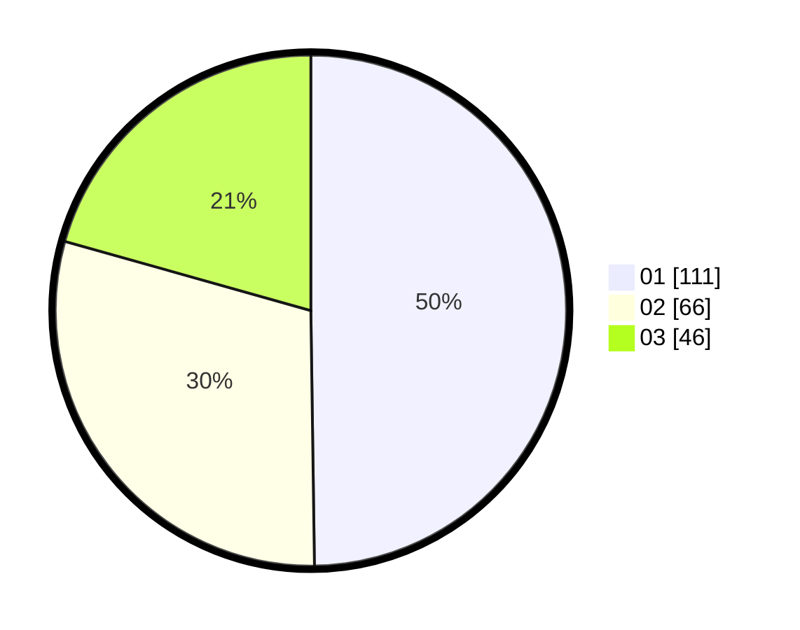

# Hasil

Hasil perolehan suara paslon dapat dilihat pada file paslon-01.txt, paslon-02.txt, dan paslon-03.txt.

Jika tidak ada, artinya data tersebut belum ada pada SIREKAP.

## Perolehan Suara

 * Paslon 01: **111**.
 * Paslon 02: **66**.
 * Paslon 03: **46**.

## Foto C Plano

https://sirekap-obj-formc.kpu.go.id/1cfc/pemilu/ppwp/31/75/08/10/03/3175081003052-20240214-203442--c18d7c23-c971-49ad-9140-cde1f4bec1cf.jpg

https://sirekap-obj-formc.kpu.go.id/1cfc/pemilu/ppwp/31/75/08/10/03/3175081003052-20240214-203659--d8bcaa75-8ca3-4d6d-8943-912e46739a1c.jpg
