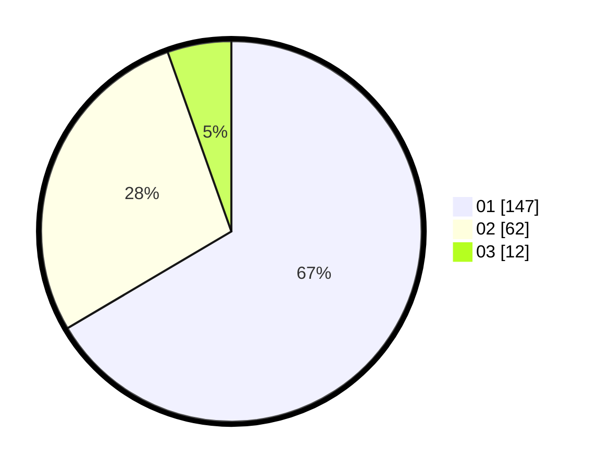

# Hasil

Hasil perolehan suara paslon dapat dilihat pada file paslon-01.txt, paslon-02.txt, dan paslon-03.txt.

Jika tidak ada, artinya data tersebut belum ada pada SIREKAP.

## Perolehan Suara

 * Paslon 01: **147**.
 * Paslon 02: **62**.
 * Paslon 03: **12**.

## Foto C Plano

https://sirekap-obj-formc.kpu.go.id/2fea/pemilu/ppwp/31/75/08/10/03/3175081003056-20240214-232832--46d98f71-b474-42a1-8356-36a9655d359c.jpg

https://sirekap-obj-formc.kpu.go.id/2fea/pemilu/ppwp/31/75/08/10/03/3175081003056-20240214-225237--6ab4d39e-6643-47ba-ac75-48340399e319.jpg

https://sirekap-obj-formc.kpu.go.id/2fea/pemilu/ppwp/31/75/08/10/03/3175081003056-20240214-225319--371edd84-734a-48ea-aea9-e6512fb124e9.jpg
