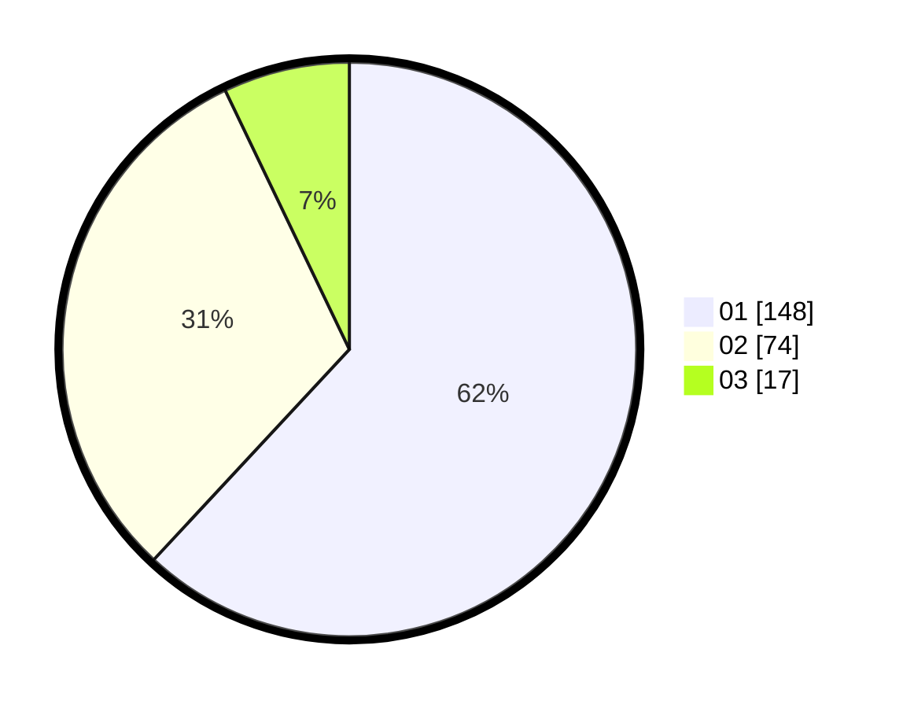

# Hasil

Hasil perolehan suara paslon dapat dilihat pada file paslon-01.txt, paslon-02.txt, dan paslon-03.txt.

Jika tidak ada, artinya data tersebut belum ada pada SIREKAP.

## Perolehan Suara

 * Paslon 01: **148**.
 * Paslon 02: **74**.
 * Paslon 03: **17**.

## Foto C Plano

https://sirekap-obj-formc.kpu.go.id/b4af/pemilu/ppwp/31/75/08/10/03/3175081003057-20240216-141153--1fcb7044-d6b6-49af-af97-730b29b45a40.jpg

https://sirekap-obj-formc.kpu.go.id/b4af/pemilu/ppwp/31/75/08/10/03/3175081003057-20240216-141154--44c1f447-2a52-4c6c-a37d-bd4bb66a2f1e.jpg

https://sirekap-obj-formc.kpu.go.id/b4af/pemilu/ppwp/31/75/08/10/03/3175081003057-20240216-141153--7d17f81e-33ca-46ad-9cdd-3b5845dd44a4.jpg

## DATA PEMILIH TETAP

Jumlah pemilih dalam DPT: **271**.
 * L: **135**.
 * P: **136**.

## DATA PENGGUNA HAK PILIH

Jumlah pengguna hak pilih dalam DPT: **232**.
 * L: **116**.
 * P: **116**.

Jumlah pengguna hak pilih dalam DPTb: **8**.
 * L: **3**.
 * P: **5**.

Jumlah pengguna hak pilih dalam DPK: **0**.
 * L: **0**.
 * P: **0**.

Jumlah pengguna hak pilih: **240**.
 * L: **119**.
 * P: **121**.

## JUMLAH SUARA SAH DAN TIDAK SAH

JUMLAH SELURUH SUARA SAH: **239**.

JUMLAH SUARA TIDAK SAH: **1**.

JUMLAH SELURUH SUARA SAH DAN SUARA TIDAK SAH: **240**.
