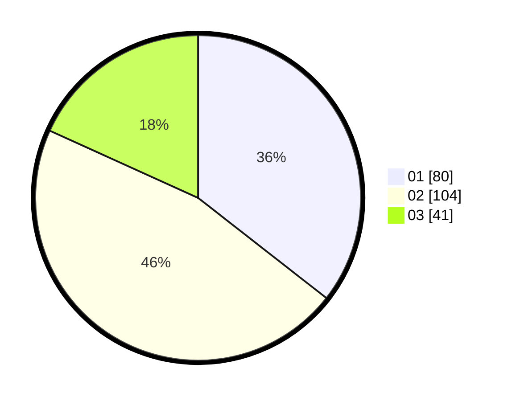

# Hasil

Hasil perolehan suara paslon dapat dilihat pada file paslon-01.txt, paslon-02.txt, dan paslon-03.txt.

Jika tidak ada, artinya data tersebut belum ada pada SIREKAP.

## Perolehan Suara

 * Paslon 01: **80**.
 * Paslon 02: **104**.
 * Paslon 03: **41**.

## Foto C Plano

https://sirekap-obj-formc.kpu.go.id/f3bd/pemilu/ppwp/31/75/08/10/03/3175081003060-20240214-191359--5aed6c77-1231-401a-a383-8860dcf611d1.jpg

https://sirekap-obj-formc.kpu.go.id/f3bd/pemilu/ppwp/31/75/08/10/03/3175081003060-20240214-191237--45d78431-8b2a-4634-88fd-534359328977.jpg

https://sirekap-obj-formc.kpu.go.id/f3bd/pemilu/ppwp/31/75/08/10/03/3175081003060-20240214-193217--fbe27965-067d-403d-a1f4-eabfe87f493b.jpg

## DATA PEMILIH TETAP

Jumlah pemilih dalam DPT: **275**.
 * L: **140**.
 * P: **135**.

## DATA PENGGUNA HAK PILIH

Jumlah pengguna hak pilih dalam DPT: **231**.
 * L: **116**.
 * P: **115**.

Jumlah pengguna hak pilih dalam DPTb: **0**.
 * L: **0**.
 * P: **0**.

Jumlah pengguna hak pilih dalam DPK: **0**.
 * L: **0**.
 * P: **0**.

Jumlah pengguna hak pilih: **231**.
 * L: **116**.
 * P: **115**.

## JUMLAH SUARA SAH DAN TIDAK SAH

JUMLAH SELURUH SUARA SAH: **225**.

JUMLAH SUARA TIDAK SAH: **6**.

JUMLAH SELURUH SUARA SAH DAN SUARA TIDAK SAH: **231**.
