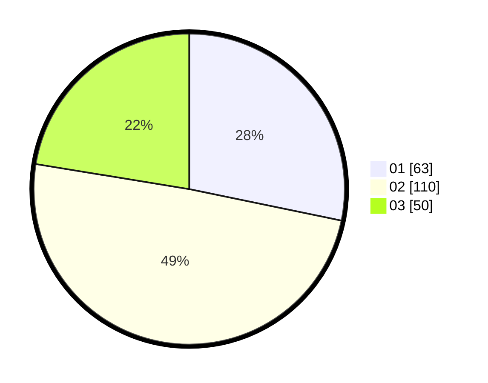

# Hasil

Hasil perolehan suara paslon dapat dilihat pada file paslon-01.txt, paslon-02.txt, dan paslon-03.txt.

Jika tidak ada, artinya data tersebut belum ada pada SIREKAP.

## Perolehan Suara

 * Paslon 01: **63**.
 * Paslon 02: **110**.
 * Paslon 03: **50**.

## Foto C Plano

https://sirekap-obj-formc.kpu.go.id/eb91/pemilu/ppwp/31/75/08/10/03/3175081003066-20240215-011301--57c9775b-bcaf-429e-8b4f-f6a5c4bc2cec.jpg

https://sirekap-obj-formc.kpu.go.id/eb91/pemilu/ppwp/31/75/08/10/03/3175081003066-20240215-011526--44c3fd57-34c5-493e-b3ae-2506493e92cc.jpg

https://sirekap-obj-formc.kpu.go.id/eb91/pemilu/ppwp/31/75/08/10/03/3175081003066-20240215-011732--fd1faf43-3787-4c05-bcf7-c021aebf22c9.jpg
