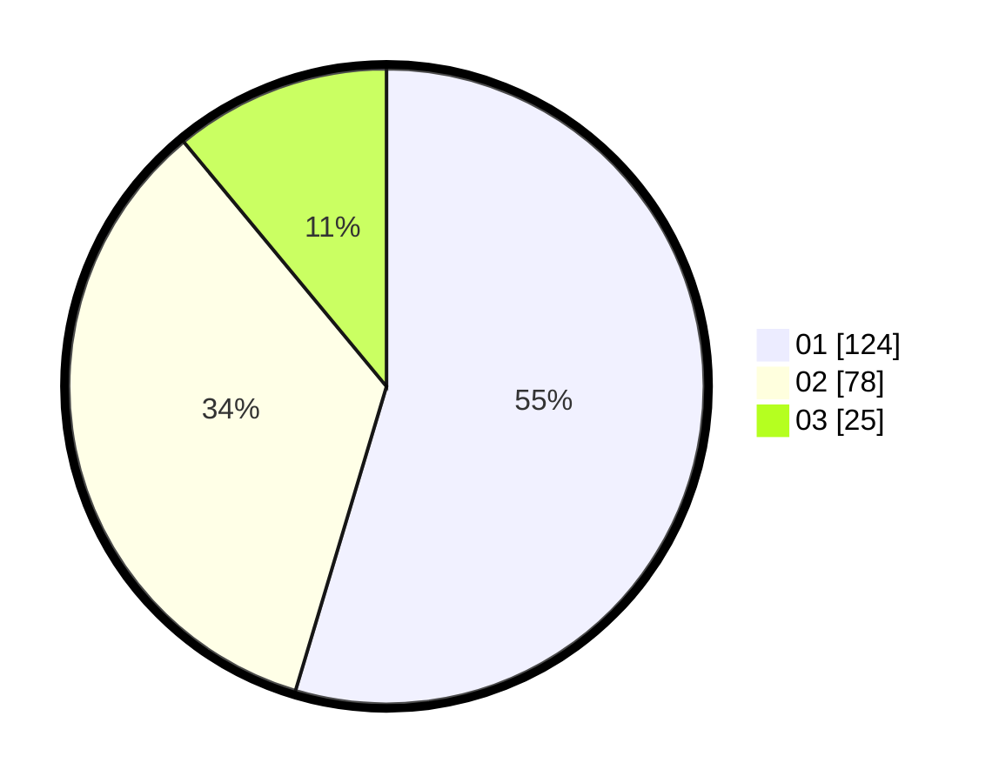

# Hasil

Hasil perolehan suara paslon dapat dilihat pada file paslon-01.txt, paslon-02.txt, dan paslon-03.txt.

Jika tidak ada, artinya data tersebut belum ada pada SIREKAP.

## Perolehan Suara

 * Paslon 01: **124**.
 * Paslon 02: **78**.
 * Paslon 03: **25**.

## Foto C Plano

https://sirekap-obj-formc.kpu.go.id/2751/pemilu/ppwp/31/75/08/10/03/3175081003069-20240216-153151--89b395e8-2a7e-4848-9854-f62449ac4583.jpg

https://sirekap-obj-formc.kpu.go.id/2751/pemilu/ppwp/31/75/08/10/03/3175081003069-20240216-153152--ead9f626-069b-43fa-95e1-a4e91ea29719.jpg

https://sirekap-obj-formc.kpu.go.id/2751/pemilu/ppwp/31/75/08/10/03/3175081003069-20240216-153151--a25a65cb-f585-48a0-bd54-d93b14a9bac1.jpg

## DATA PEMILIH TETAP

Jumlah pemilih dalam DPT: **276**.
 * L: **139**.
 * P: **137**.

## DATA PENGGUNA HAK PILIH

Jumlah pengguna hak pilih dalam DPT: **225**.
 * L: **107**.
 * P: **118**.

Jumlah pengguna hak pilih dalam DPTb: **1**.
 * L: **1**.
 * P: **0**.

Jumlah pengguna hak pilih dalam DPK: **3**.
 * L: **1**.
 * P: **2**.

Jumlah pengguna hak pilih: **229**.
 * L: **109**.
 * P: **120**.

## JUMLAH SUARA SAH DAN TIDAK SAH

JUMLAH SELURUH SUARA SAH: **227**.

JUMLAH SUARA TIDAK SAH: **2**.

JUMLAH SELURUH SUARA SAH DAN SUARA TIDAK SAH: **229**.
