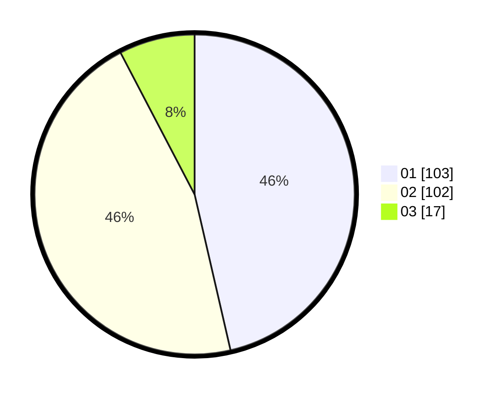

# Hasil

Hasil perolehan suara paslon dapat dilihat pada file paslon-01.txt, paslon-02.txt, dan paslon-03.txt.

Jika tidak ada, artinya data tersebut belum ada pada SIREKAP.

## Perolehan Suara

 * Paslon 01: **103**.
 * Paslon 02: **102**.
 * Paslon 03: **17**.

## Foto C Plano

https://sirekap-obj-formc.kpu.go.id/e3df/pemilu/ppwp/31/75/08/10/03/3175081003070-20240216-055342--9b3c7da2-ff72-458c-a993-d0ab49ce9d05.jpg

https://sirekap-obj-formc.kpu.go.id/e3df/pemilu/ppwp/31/75/08/10/03/3175081003070-20240216-055344--e04201a0-87e8-4e54-a1dd-fcc1d1173209.jpg

https://sirekap-obj-formc.kpu.go.id/e3df/pemilu/ppwp/31/75/08/10/03/3175081003070-20240216-055343--bb1dd2bb-55ae-45f3-9e4e-076da3a98645.jpg

## DATA PEMILIH TETAP

Jumlah pemilih dalam DPT: **227**.
 * L: **107**.
 * P: **120**.

## DATA PENGGUNA HAK PILIH

Jumlah pengguna hak pilih dalam DPT: **227**.
 * L: **107**.
 * P: **120**.

Jumlah pengguna hak pilih dalam DPTb: **2**.
 * L: **0**.
 * P: **2**.

Jumlah pengguna hak pilih dalam DPK: **0**.
 * L: **0**.
 * P: **0**.

Jumlah pengguna hak pilih: **229**.
 * L: **107**.
 * P: **122**.

## JUMLAH SUARA SAH DAN TIDAK SAH

JUMLAH SELURUH SUARA SAH: **222**.

JUMLAH SUARA TIDAK SAH: **7**.

JUMLAH SELURUH SUARA SAH DAN SUARA TIDAK SAH: **229**.
