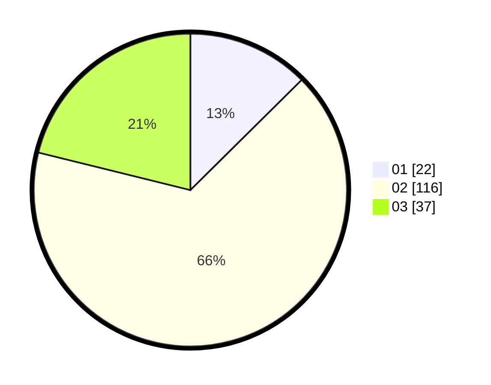

# Hasil

Hasil perolehan suara paslon dapat dilihat pada file paslon-01.txt, paslon-02.txt, dan paslon-03.txt.

Jika tidak ada, artinya data tersebut belum ada pada SIREKAP.

## Perolehan Suara

 * Paslon 01: **22**.
 * Paslon 02: **116**.
 * Paslon 03: **37**.

## Foto C Plano

https://sirekap-obj-formc.kpu.go.id/4b1d/pemilu/ppwp/31/75/08/10/03/3175081003071-20240214-190623--a2bbe585-5cff-4c2b-b9cb-a3dc66a9ae1d.jpg

https://sirekap-obj-formc.kpu.go.id/4b1d/pemilu/ppwp/31/75/08/10/03/3175081003071-20240214-190853--a3e88d77-89a4-461a-baec-4db75d907a1e.jpg

https://sirekap-obj-formc.kpu.go.id/4b1d/pemilu/ppwp/31/75/08/10/03/3175081003071-20240214-191102--dc2ac5a9-e955-461d-b88d-890e5eb74671.jpg
