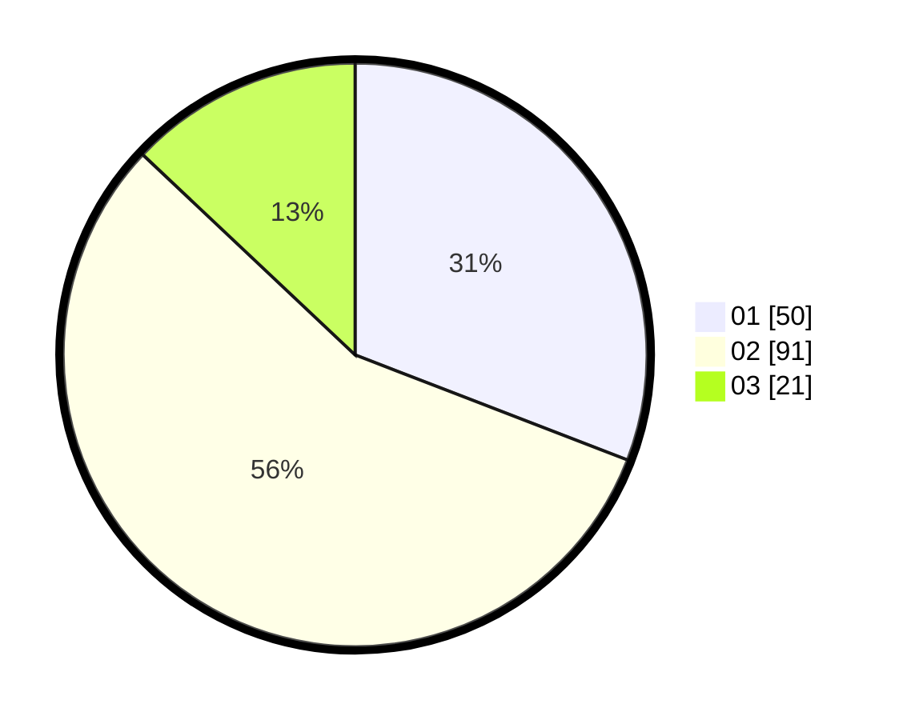

# Hasil

Hasil perolehan suara paslon dapat dilihat pada file paslon-01.txt, paslon-02.txt, dan paslon-03.txt.

Jika tidak ada, artinya data tersebut belum ada pada SIREKAP.

## Perolehan Suara

 * Paslon 01: **50**.
 * Paslon 02: **91**.
 * Paslon 03: **21**.

## Foto C Plano

https://sirekap-obj-formc.kpu.go.id/8a21/pemilu/ppwp/31/75/08/10/03/3175081003072-20240214-232058--febe5711-81a4-4999-9e4b-241d01d75249.jpg

https://sirekap-obj-formc.kpu.go.id/8a21/pemilu/ppwp/31/75/08/10/03/3175081003072-20240214-232345--9d01b291-886b-405e-9764-0d0147ea7620.jpg

https://sirekap-obj-formc.kpu.go.id/8a21/pemilu/ppwp/31/75/08/10/03/3175081003072-20240214-232436--97ee478c-3b39-4380-a22c-0f19f9b0cb60.jpg
