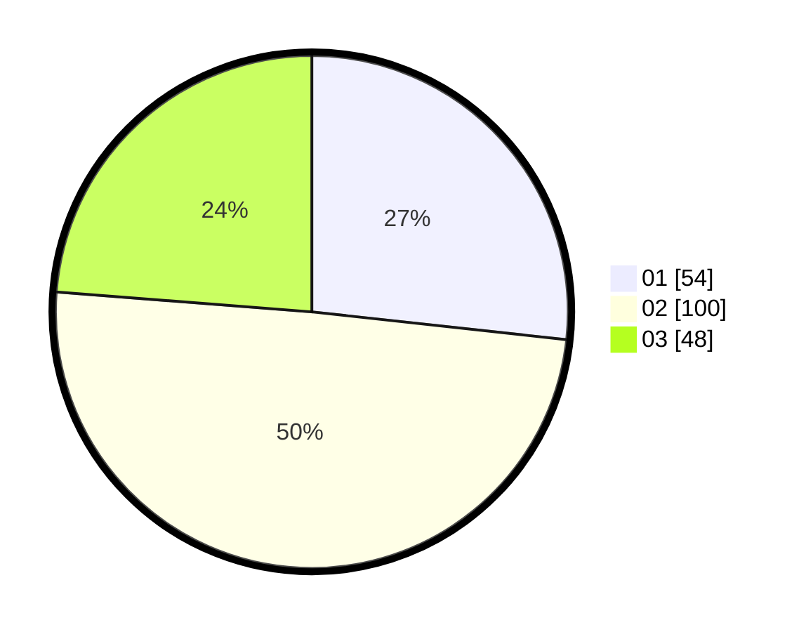

# Hasil

Hasil perolehan suara paslon dapat dilihat pada file paslon-01.txt, paslon-02.txt, dan paslon-03.txt.

Jika tidak ada, artinya data tersebut belum ada pada SIREKAP.

## Perolehan Suara

 * Paslon 01: **54**.
 * Paslon 02: **100**.
 * Paslon 03: **48**.

## Foto C Plano

https://sirekap-obj-formc.kpu.go.id/0a29/pemilu/ppwp/31/75/08/10/03/3175081003079-20240214-231223--5acd929f-1ac9-4955-aa40-9a79a9d0ea25.jpg

https://sirekap-obj-formc.kpu.go.id/0a29/pemilu/ppwp/31/75/08/10/03/3175081003079-20240214-231506--1878aaf6-57cd-4cbc-87d7-22102e26fb22.jpg

https://sirekap-obj-formc.kpu.go.id/0a29/pemilu/ppwp/31/75/08/10/03/3175081003079-20240214-231156--27b58456-396b-48a4-88bc-a69245b5b926.jpg
