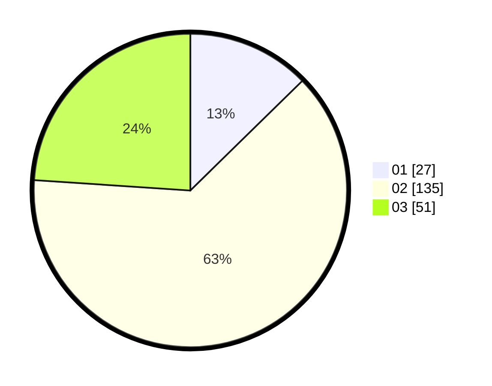

# Hasil

Hasil perolehan suara paslon dapat dilihat pada file paslon-01.txt, paslon-02.txt, dan paslon-03.txt.

Jika tidak ada, artinya data tersebut belum ada pada SIREKAP.

## Perolehan Suara

 * Paslon 01: **27**.
 * Paslon 02: **135**.
 * Paslon 03: **51**.

## Foto C Plano

https://sirekap-obj-formc.kpu.go.id/9e5a/pemilu/ppwp/31/75/08/10/03/3175081003081-20240214-195224--1d8cae66-8d9e-4685-ba54-522fc52d9e26.jpg

https://sirekap-obj-formc.kpu.go.id/9e5a/pemilu/ppwp/31/75/08/10/03/3175081003081-20240214-195320--d6c6aada-6148-4a68-8f40-2d9595a356f1.jpg

https://sirekap-obj-formc.kpu.go.id/9e5a/pemilu/ppwp/31/75/08/10/03/3175081003081-20240214-195411--b19de719-ccd6-49f8-8b69-29d9165b440b.jpg

## DATA PEMILIH TETAP

Jumlah pemilih dalam DPT: **290**.
 * L: **144**.
 * P: **146**.

## DATA PENGGUNA HAK PILIH

Jumlah pengguna hak pilih dalam DPT: **212**.
 * L: **105**.
 * P: **107**.

Jumlah pengguna hak pilih dalam DPTb: **0**.
 * L: **0**.
 * P: **0**.

Jumlah pengguna hak pilih dalam DPK: **4**.
 * L: **2**.
 * P: **2**.

Jumlah pengguna hak pilih: **216**.
 * L: **107**.
 * P: **109**.

## JUMLAH SUARA SAH DAN TIDAK SAH

JUMLAH SELURUH SUARA SAH: **213**.

JUMLAH SUARA TIDAK SAH: **3**.

JUMLAH SELURUH SUARA SAH DAN SUARA TIDAK SAH: **216**.
