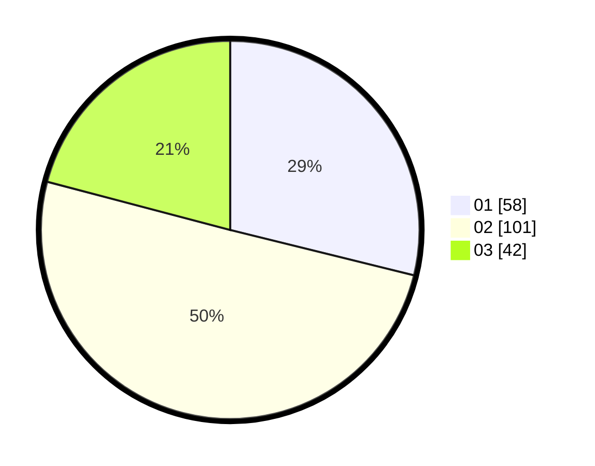

# Hasil

Hasil perolehan suara paslon dapat dilihat pada file paslon-01.txt, paslon-02.txt, dan paslon-03.txt.

Jika tidak ada, artinya data tersebut belum ada pada SIREKAP.

## Perolehan Suara

 * Paslon 01: **58**.
 * Paslon 02: **101**.
 * Paslon 03: **42**.

## Foto C Plano

https://sirekap-obj-formc.kpu.go.id/2bdf/pemilu/ppwp/31/75/08/10/03/3175081003086-20240214-231558--cd09d606-2cbf-4267-9e32-5b482a3e9386.jpg

https://sirekap-obj-formc.kpu.go.id/2bdf/pemilu/ppwp/31/75/08/10/03/3175081003086-20240214-232111--947404f3-e7e7-4b61-a813-c5e1e648a88b.jpg

https://sirekap-obj-formc.kpu.go.id/2bdf/pemilu/ppwp/31/75/08/10/03/3175081003086-20240214-232240--079194d4-d87c-46a4-ab74-ff0dfb46b5d6.jpg
