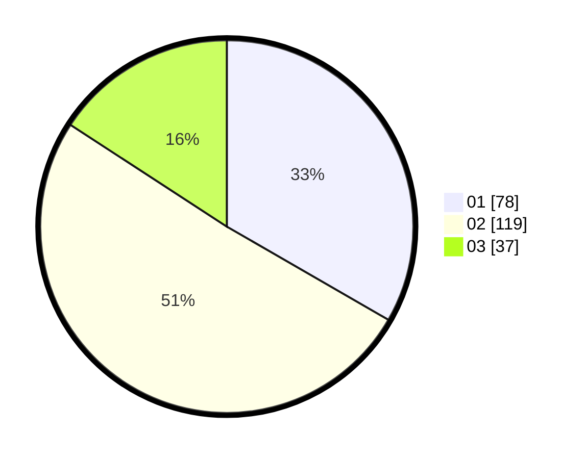

# Hasil

Hasil perolehan suara paslon dapat dilihat pada file paslon-01.txt, paslon-02.txt, dan paslon-03.txt.

Jika tidak ada, artinya data tersebut belum ada pada SIREKAP.

## Perolehan Suara

 * Paslon 01: **78**.
 * Paslon 02: **119**.
 * Paslon 03: **37**.

## Foto C Plano

https://sirekap-obj-formc.kpu.go.id/7aaa/pemilu/ppwp/31/75/08/10/03/3175081003092-20240214-231148--0012c12b-1fab-413a-801a-2cd69ddd1f80.jpg

https://sirekap-obj-formc.kpu.go.id/7aaa/pemilu/ppwp/31/75/08/10/03/3175081003092-20240214-231219--b6a40770-c97c-4bee-9b17-aca8f10f5900.jpg

https://sirekap-obj-formc.kpu.go.id/7aaa/pemilu/ppwp/31/75/08/10/03/3175081003092-20240214-231245--5a9c7afd-0b05-4934-8f91-42c66a1de084.jpg
