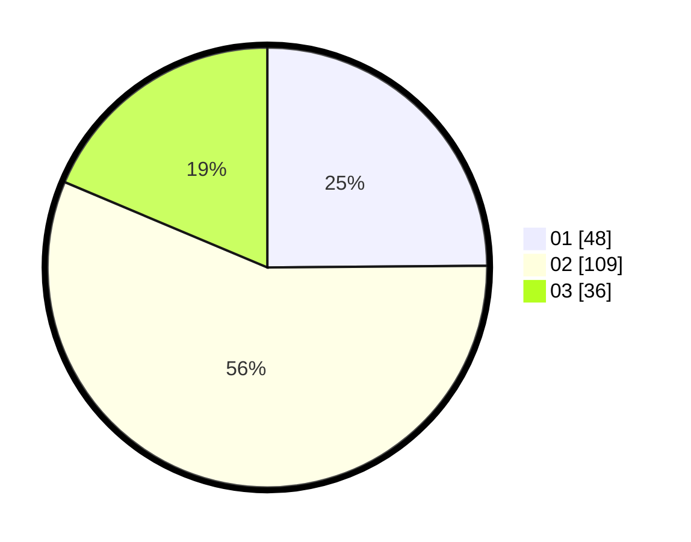

# Hasil

Hasil perolehan suara paslon dapat dilihat pada file paslon-01.txt, paslon-02.txt, dan paslon-03.txt.

Jika tidak ada, artinya data tersebut belum ada pada SIREKAP.

## Perolehan Suara

 * Paslon 01: **48**.
 * Paslon 02: **109**.
 * Paslon 03: **36**.

## Foto C Plano

https://sirekap-obj-formc.kpu.go.id/6a1c/pemilu/ppwp/31/75/08/10/03/3175081003093-20240214-155845--0153eb3d-49ab-4cf7-9708-787a360399aa.jpg

https://sirekap-obj-formc.kpu.go.id/6a1c/pemilu/ppwp/31/75/08/10/03/3175081003093-20240214-193411--80d612e7-d224-4787-bcb6-86b804481270.jpg
