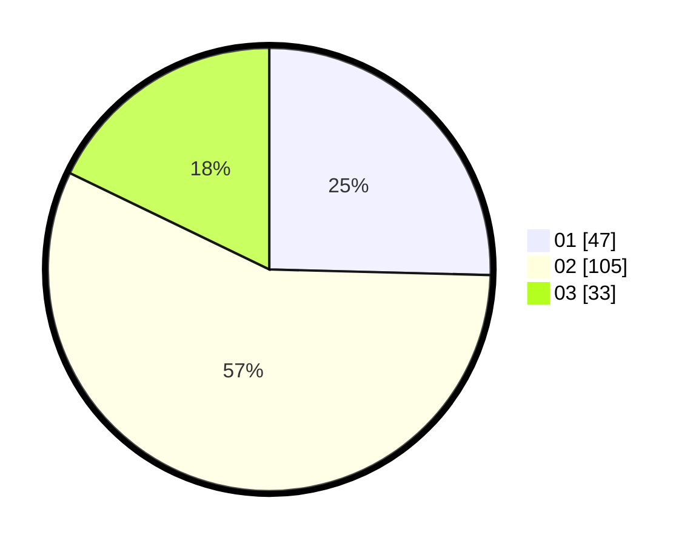

# Hasil

Hasil perolehan suara paslon dapat dilihat pada file paslon-01.txt, paslon-02.txt, dan paslon-03.txt.

Jika tidak ada, artinya data tersebut belum ada pada SIREKAP.

## Perolehan Suara

 * Paslon 01: **47**.
 * Paslon 02: **105**.
 * Paslon 03: **33**.

## Foto C Plano

https://sirekap-obj-formc.kpu.go.id/cdc2/pemilu/ppwp/31/75/08/10/03/3175081003095-20240214-230704--56ce00fb-a124-4f4c-87ff-96ee9ae441d3.jpg

https://sirekap-obj-formc.kpu.go.id/cdc2/pemilu/ppwp/31/75/08/10/03/3175081003095-20240214-230752--b77412e5-b555-423a-a69e-3ffeeb3cec92.jpg
