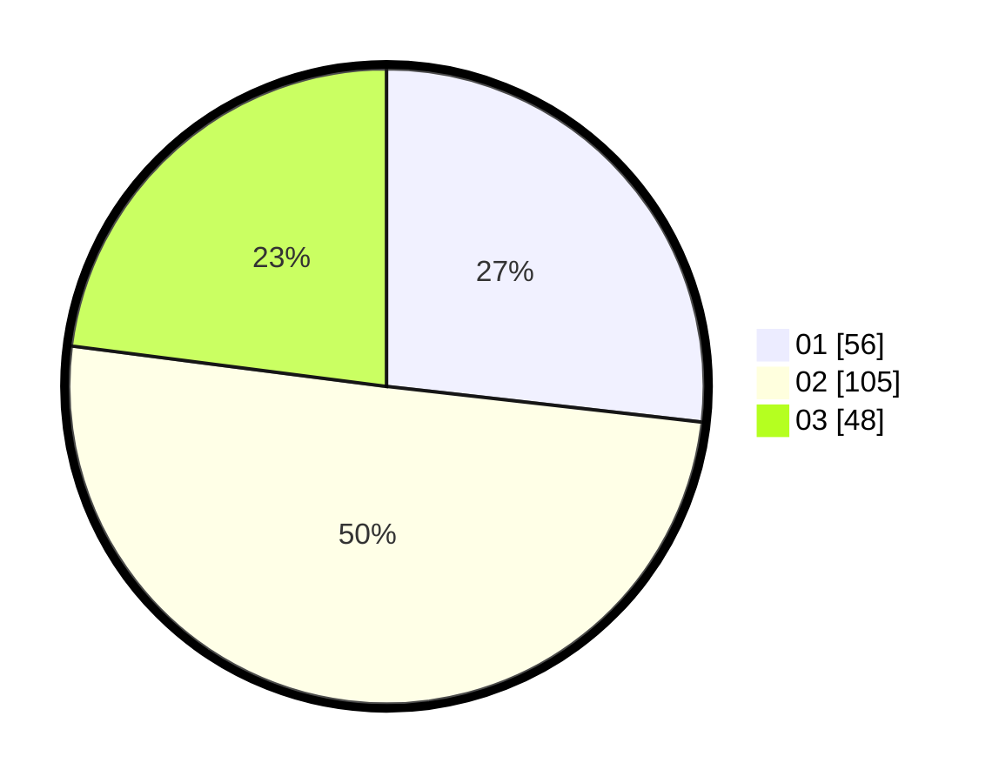

# Hasil

Hasil perolehan suara paslon dapat dilihat pada file paslon-01.txt, paslon-02.txt, dan paslon-03.txt.

Jika tidak ada, artinya data tersebut belum ada pada SIREKAP.

## Perolehan Suara

 * Paslon 01: **56**.
 * Paslon 02: **105**.
 * Paslon 03: **48**.

## Foto C Plano

https://sirekap-obj-formc.kpu.go.id/dde8/pemilu/ppwp/31/75/08/10/03/3175081003098-20240214-230828--1656ccec-1304-48af-93b0-991043c6c746.jpg

https://sirekap-obj-formc.kpu.go.id/dde8/pemilu/ppwp/31/75/08/10/03/3175081003098-20240214-231705--c91ca72e-865d-46d1-a659-73f1f304f943.jpg

https://sirekap-obj-formc.kpu.go.id/dde8/pemilu/ppwp/31/75/08/10/03/3175081003098-20240214-231952--f3b637b8-4c50-4b2d-9950-0175916d2650.jpg
