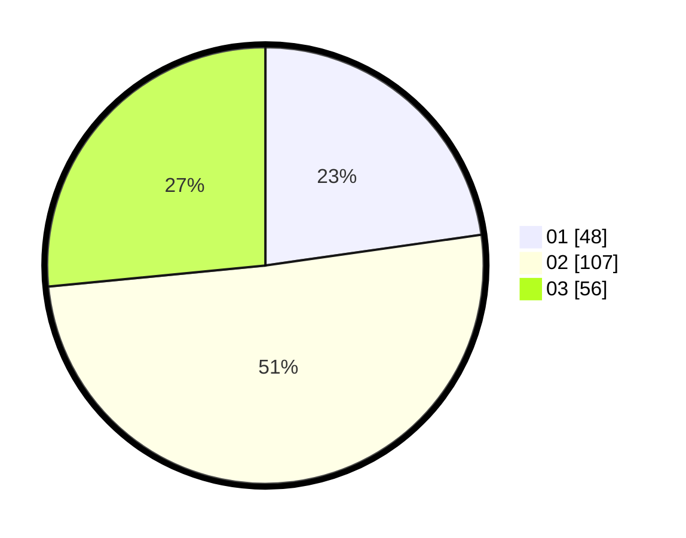

# Hasil

Hasil perolehan suara paslon dapat dilihat pada file paslon-01.txt, paslon-02.txt, dan paslon-03.txt.

Jika tidak ada, artinya data tersebut belum ada pada SIREKAP.

## Perolehan Suara

 * Paslon 01: **48**.
 * Paslon 02: **107**.
 * Paslon 03: **56**.

## Foto C Plano

https://sirekap-obj-formc.kpu.go.id/419c/pemilu/ppwp/31/75/08/10/03/3175081003100-20240214-215842--3a4e77c9-e500-49d2-9cc6-54ed90bb13ee.jpg

https://sirekap-obj-formc.kpu.go.id/419c/pemilu/ppwp/31/75/08/10/03/3175081003100-20240214-220027--e9ccfecd-3735-4abc-a560-44314916ab7d.jpg
