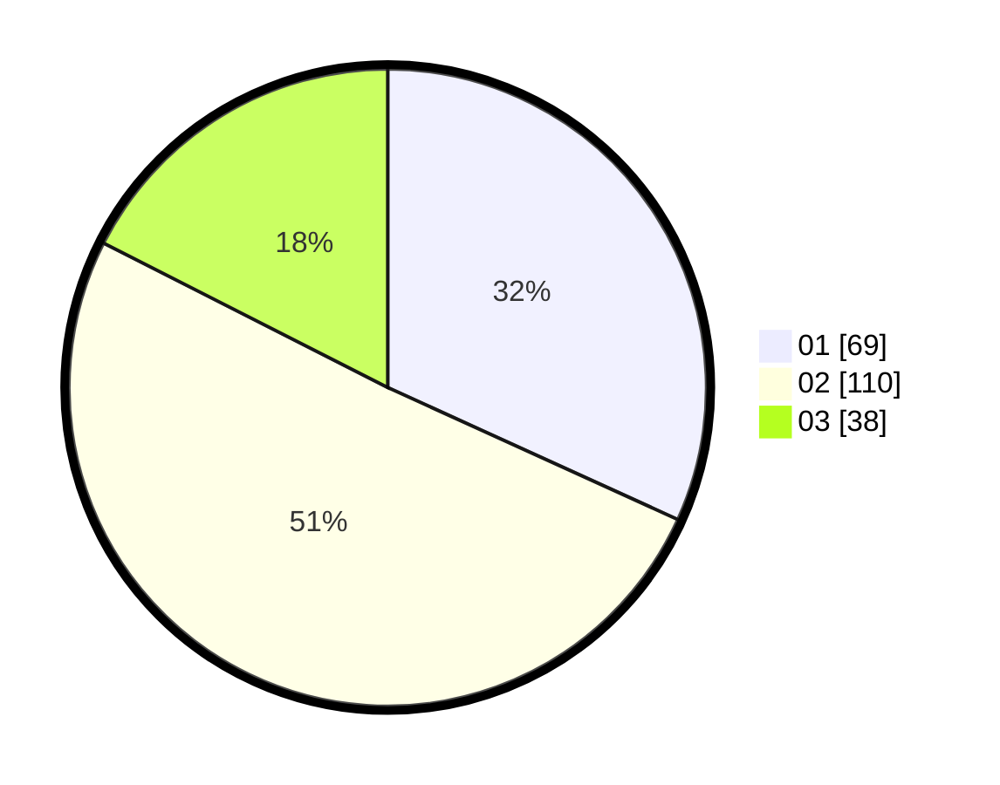

# Hasil

Hasil perolehan suara paslon dapat dilihat pada file paslon-01.txt, paslon-02.txt, dan paslon-03.txt.

Jika tidak ada, artinya data tersebut belum ada pada SIREKAP.

## Perolehan Suara

 * Paslon 01: **69**.
 * Paslon 02: **110**.
 * Paslon 03: **38**.

## Foto C Plano

https://sirekap-obj-formc.kpu.go.id/63a0/pemilu/ppwp/31/75/08/10/03/3175081003101-20240214-155753--75d2d91f-38ad-461b-9626-357bbc6e6a64.jpg

https://sirekap-obj-formc.kpu.go.id/63a0/pemilu/ppwp/31/75/08/10/03/3175081003101-20240216-025351--0c390c25-659f-4c69-88ab-6d336a68b487.jpg

https://sirekap-obj-formc.kpu.go.id/63a0/pemilu/ppwp/31/75/08/10/03/3175081003101-20240216-025345--95366ee6-e688-45f4-be43-01fd16fde219.jpg

## DATA PEMILIH TETAP

Jumlah pemilih dalam DPT: **281**.
 * L: **136**.
 * P: **145**.

## DATA PENGGUNA HAK PILIH

Jumlah pengguna hak pilih dalam DPT: **218**.
 * L: **101**.
 * P: **117**.

Jumlah pengguna hak pilih dalam DPTb: **1**.
 * L: **0**.
 * P: **1**.

Jumlah pengguna hak pilih dalam DPK: **2**.
 * L: **1**.
 * P: **1**.

Jumlah pengguna hak pilih: **221**.
 * L: **102**.
 * P: **119**.

## JUMLAH SUARA SAH DAN TIDAK SAH

JUMLAH SELURUH SUARA SAH: **217**.

JUMLAH SUARA TIDAK SAH: **4**.

JUMLAH SELURUH SUARA SAH DAN SUARA TIDAK SAH: **221**.
