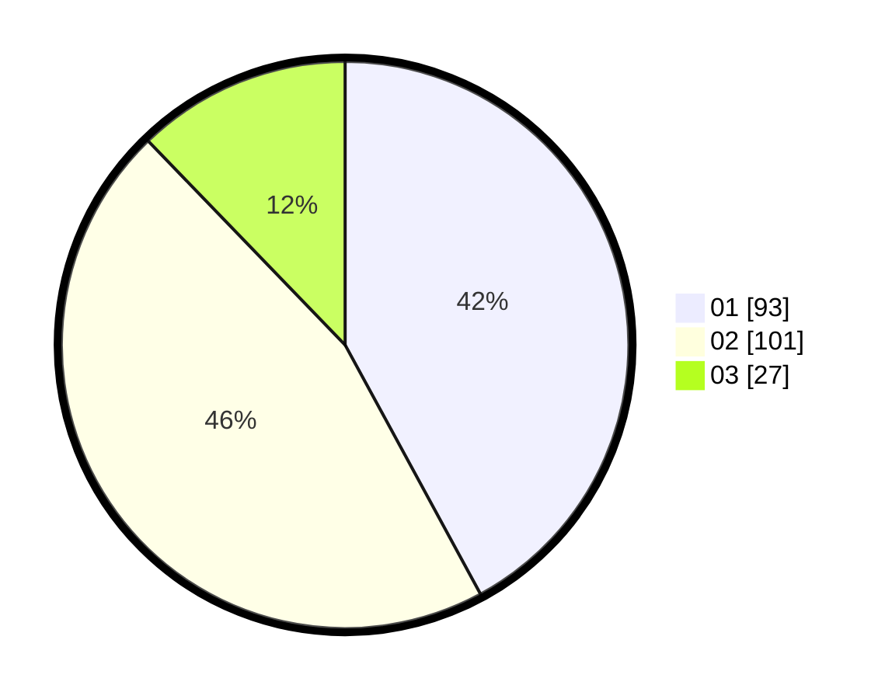

# Hasil

Hasil perolehan suara paslon dapat dilihat pada file paslon-01.txt, paslon-02.txt, dan paslon-03.txt.

Jika tidak ada, artinya data tersebut belum ada pada SIREKAP.

## Perolehan Suara

 * Paslon 01: **93**.
 * Paslon 02: **101**.
 * Paslon 03: **27**.

## Foto C Plano

https://sirekap-obj-formc.kpu.go.id/057e/pemilu/ppwp/31/75/08/10/03/3175081003102-20240214-194941--12c26405-5c27-4c95-b8df-730dede64b2c.jpg

https://sirekap-obj-formc.kpu.go.id/057e/pemilu/ppwp/31/75/08/10/03/3175081003102-20240214-195019--190fafa2-9a60-4264-b798-667d1d279a4d.jpg

https://sirekap-obj-formc.kpu.go.id/057e/pemilu/ppwp/31/75/08/10/03/3175081003102-20240214-204040--0e7a04c9-929d-4f7f-ac65-9d3e2e2915bc.jpg

## DATA PEMILIH TETAP

Jumlah pemilih dalam DPT: **293**.
 * L: **148**.
 * P: **145**.

## DATA PENGGUNA HAK PILIH

Jumlah pengguna hak pilih dalam DPT: **219**.
 * L: **106**.
 * P: **113**.

Jumlah pengguna hak pilih dalam DPTb: **1**.
 * L: **0**.
 * P: **1**.

Jumlah pengguna hak pilih dalam DPK: **1**.
 * L: **1**.
 * P: **0**.

Jumlah pengguna hak pilih: **221**.
 * L: **107**.
 * P: **114**.

## JUMLAH SUARA SAH DAN TIDAK SAH

JUMLAH SELURUH SUARA SAH: **221**.

JUMLAH SUARA TIDAK SAH: **0**.

JUMLAH SELURUH SUARA SAH DAN SUARA TIDAK SAH: **221**.
