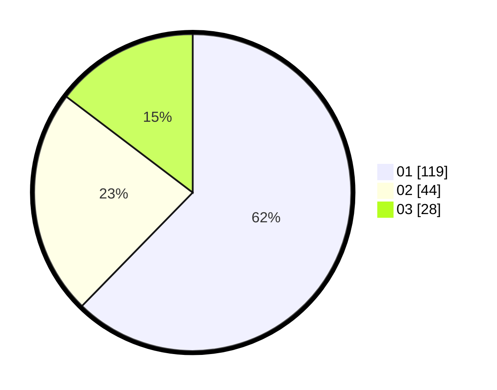

# Hasil

Hasil perolehan suara paslon dapat dilihat pada file paslon-01.txt, paslon-02.txt, dan paslon-03.txt.

Jika tidak ada, artinya data tersebut belum ada pada SIREKAP.

## Perolehan Suara

 * Paslon 01: **119**.
 * Paslon 02: **44**.
 * Paslon 03: **28**.

## Foto C Plano

https://sirekap-obj-formc.kpu.go.id/6ce7/pemilu/ppwp/31/75/08/10/03/3175081003105-20240214-231021--ca38de58-919f-4724-90be-27feaf232358.jpg

https://sirekap-obj-formc.kpu.go.id/6ce7/pemilu/ppwp/31/75/08/10/03/3175081003105-20240214-231137--fa0e2635-0e8f-4619-b5b5-633760ce09c7.jpg

https://sirekap-obj-formc.kpu.go.id/6ce7/pemilu/ppwp/31/75/08/10/03/3175081003105-20240214-231250--9e18e10a-bd05-487f-9be1-fafb40783c5a.jpg
