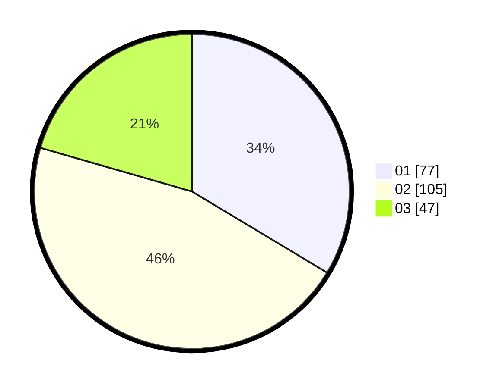

# Hasil

Hasil perolehan suara paslon dapat dilihat pada file paslon-01.txt, paslon-02.txt, dan paslon-03.txt.

Jika tidak ada, artinya data tersebut belum ada pada SIREKAP.

## Perolehan Suara

 * Paslon 01: **77**.
 * Paslon 02: **105**.
 * Paslon 03: **47**.

## Foto C Plano

https://sirekap-obj-formc.kpu.go.id/d421/pemilu/ppwp/31/75/08/10/03/3175081003109-20240216-190427--8cca1be8-e226-4a0c-a150-34843ce8cbf4.jpg

https://sirekap-obj-formc.kpu.go.id/d421/pemilu/ppwp/31/75/08/10/03/3175081003109-20240216-184340--1ab1cdc3-c270-42ad-9864-23e94c8846f7.jpg
