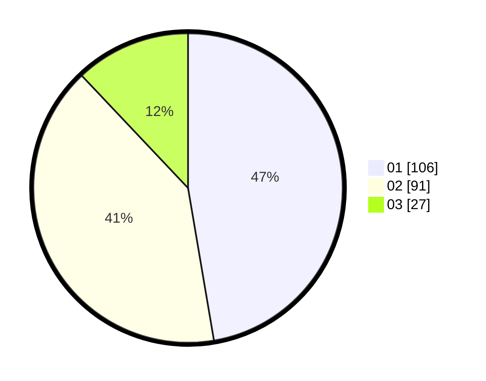

# Hasil

Hasil perolehan suara paslon dapat dilihat pada file paslon-01.txt, paslon-02.txt, dan paslon-03.txt.

Jika tidak ada, artinya data tersebut belum ada pada SIREKAP.

## Perolehan Suara

 * Paslon 01: **106**.
 * Paslon 02: **91**.
 * Paslon 03: **27**.

## Foto C Plano

https://sirekap-obj-formc.kpu.go.id/5265/pemilu/ppwp/31/75/08/10/03/3175081003111-20240215-000200--5ce7b06b-b199-45ab-992c-516b1d40af4e.jpg

https://sirekap-obj-formc.kpu.go.id/5265/pemilu/ppwp/31/75/08/10/03/3175081003111-20240215-000315--e4159354-8915-46db-b1dc-72c227960664.jpg
