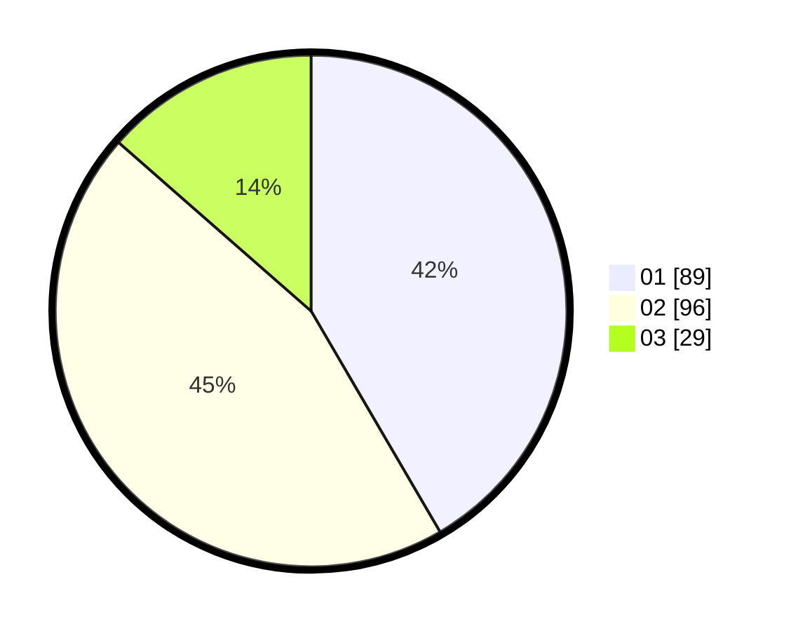

# Hasil

Hasil perolehan suara paslon dapat dilihat pada file paslon-01.txt, paslon-02.txt, dan paslon-03.txt.

Jika tidak ada, artinya data tersebut belum ada pada SIREKAP.

## Perolehan Suara

 * Paslon 01: **89**.
 * Paslon 02: **96**.
 * Paslon 03: **29**.

## Foto C Plano

https://sirekap-obj-formc.kpu.go.id/ecfb/pemilu/ppwp/31/75/08/10/03/3175081003112-20240215-022129--9870ba95-61e4-4a33-806e-f1408d172fa9.jpg

https://sirekap-obj-formc.kpu.go.id/ecfb/pemilu/ppwp/31/75/08/10/03/3175081003112-20240215-022539--18ca221c-1ded-4b91-a007-8c84ed45b0ad.jpg

https://sirekap-obj-formc.kpu.go.id/ecfb/pemilu/ppwp/31/75/08/10/03/3175081003112-20240214-202225--c80cd02b-375f-4d58-a806-d8b68b25db6c.jpg
