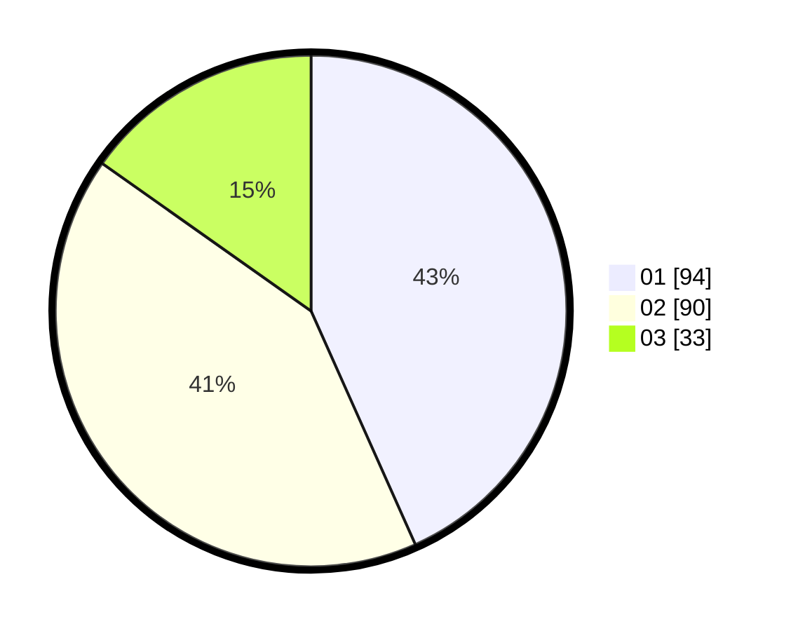

# Hasil

Hasil perolehan suara paslon dapat dilihat pada file paslon-01.txt, paslon-02.txt, dan paslon-03.txt.

Jika tidak ada, artinya data tersebut belum ada pada SIREKAP.

## Perolehan Suara

 * Paslon 01: **94**.
 * Paslon 02: **90**.
 * Paslon 03: **33**.

## Foto C Plano

https://sirekap-obj-formc.kpu.go.id/2406/pemilu/ppwp/31/75/08/10/03/3175081003113-20240215-235758--ca46c533-f082-40f4-9861-c9dd66ad81f0.jpg

https://sirekap-obj-formc.kpu.go.id/2406/pemilu/ppwp/31/75/08/10/03/3175081003113-20240215-235801--306b37dc-047f-44ff-af1b-69d1b24f9127.jpg

https://sirekap-obj-formc.kpu.go.id/2406/pemilu/ppwp/31/75/08/10/03/3175081003113-20240215-235759--77efdc36-3731-42e5-8a26-c21aa5b2828e.jpg

## DATA PEMILIH TETAP

Jumlah pemilih dalam DPT: **272**.
 * L: **130**.
 * P: **142**.

## DATA PENGGUNA HAK PILIH

Jumlah pengguna hak pilih dalam DPT: **215**.
 * L: **98**.
 * P: **117**.

Jumlah pengguna hak pilih dalam DPTb: **2**.
 * L: **1**.
 * P: **1**.

Jumlah pengguna hak pilih dalam DPK: **2**.
 * L: **0**.
 * P: **2**.

Jumlah pengguna hak pilih: **219**.
 * L: **99**.
 * P: **120**.

## JUMLAH SUARA SAH DAN TIDAK SAH

JUMLAH SELURUH SUARA SAH: **217**.

JUMLAH SUARA TIDAK SAH: **2**.

JUMLAH SELURUH SUARA SAH DAN SUARA TIDAK SAH: **219**.
