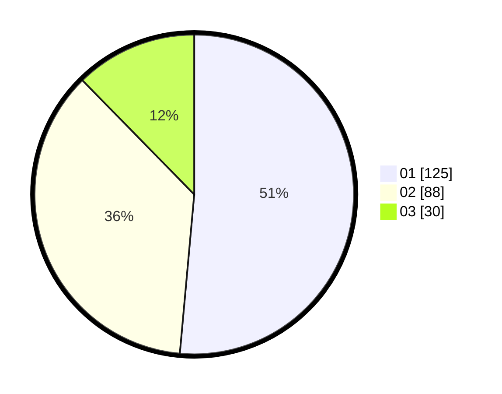

# Hasil

Hasil perolehan suara paslon dapat dilihat pada file paslon-01.txt, paslon-02.txt, dan paslon-03.txt.

Jika tidak ada, artinya data tersebut belum ada pada SIREKAP.

## Perolehan Suara

 * Paslon 01: **125**.
 * Paslon 02: **88**.
 * Paslon 03: **30**.

## Foto C Plano

https://sirekap-obj-formc.kpu.go.id/8b72/pemilu/ppwp/31/75/08/10/03/3175081003115-20240214-235407--2cf7b7c2-4409-438e-8a79-0fd11dfadcf3.jpg

https://sirekap-obj-formc.kpu.go.id/8b72/pemilu/ppwp/31/75/08/10/03/3175081003115-20240214-235559--7a1b1524-b488-4ed4-bed7-a69b5019b2bc.jpg

https://sirekap-obj-formc.kpu.go.id/8b72/pemilu/ppwp/31/75/08/10/03/3175081003115-20240215-000159--4889fec3-6acc-42eb-a6c2-8be8a052aa6a.jpg

## DATA PEMILIH TETAP

Jumlah pemilih dalam DPT: **279**.
 * L: **142**.
 * P: **137**.

## DATA PENGGUNA HAK PILIH

Jumlah pengguna hak pilih dalam DPT: **279**.
 * L: **142**.
 * P: **137**.

Jumlah pengguna hak pilih dalam DPTb: **0**.
 * L: **0**.
 * P: **0**.

Jumlah pengguna hak pilih dalam DPK: **2**.
 * L: **2**.
 * P: **0**.

Jumlah pengguna hak pilih: **281**.
 * L: **144**.
 * P: **137**.

## JUMLAH SUARA SAH DAN TIDAK SAH

JUMLAH SELURUH SUARA SAH: **243**.

JUMLAH SUARA TIDAK SAH: **1**.

JUMLAH SELURUH SUARA SAH DAN SUARA TIDAK SAH: **244**.
