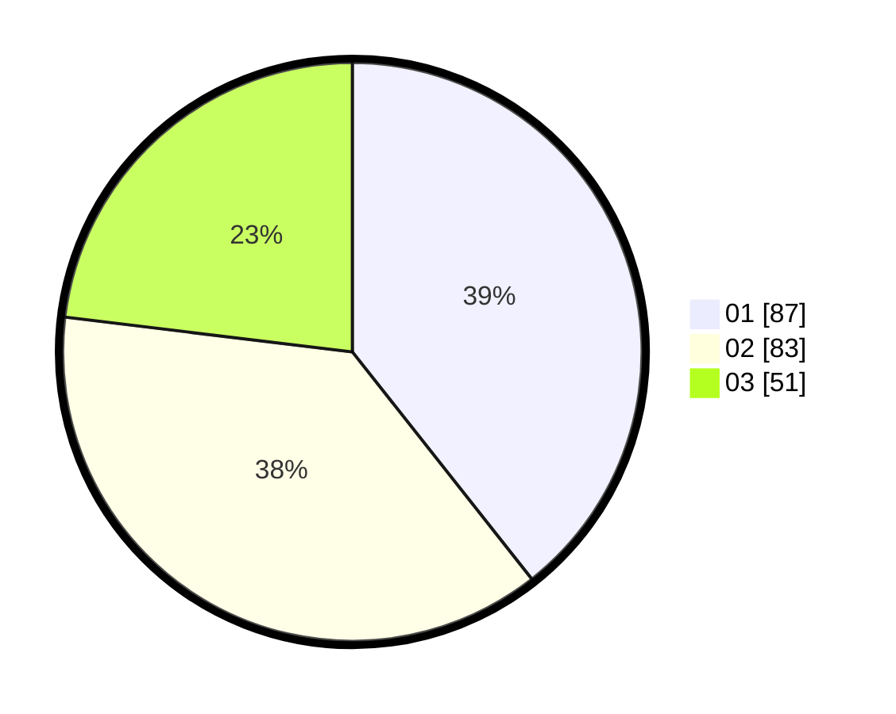

# Hasil

Hasil perolehan suara paslon dapat dilihat pada file paslon-01.txt, paslon-02.txt, dan paslon-03.txt.

Jika tidak ada, artinya data tersebut belum ada pada SIREKAP.

## Perolehan Suara

 * Paslon 01: **87**.
 * Paslon 02: **83**.
 * Paslon 03: **51**.

## Foto C Plano

https://sirekap-obj-formc.kpu.go.id/b4ac/pemilu/ppwp/31/75/08/10/03/3175081003116-20240216-144516--fee11154-3cb1-4fe0-9f02-ca0f56f9034d.jpg

https://sirekap-obj-formc.kpu.go.id/b4ac/pemilu/ppwp/31/75/08/10/03/3175081003116-20240216-144518--30aea1f1-339c-461d-866c-9ee2d30d98bb.jpg

https://sirekap-obj-formc.kpu.go.id/b4ac/pemilu/ppwp/31/75/08/10/03/3175081003116-20240216-144517--d2bfa829-971f-46fe-98b4-c82f44ae4cad.jpg

## DATA PEMILIH TETAP

Jumlah pemilih dalam DPT: **287**.
 * L: **134**.
 * P: **153**.

## DATA PENGGUNA HAK PILIH

Jumlah pengguna hak pilih dalam DPT: **223**.
 * L: **102**.
 * P: **121**.

Jumlah pengguna hak pilih dalam DPTb: **1**.
 * L: **0**.
 * P: **1**.

Jumlah pengguna hak pilih dalam DPK: **0**.
 * L: **0**.
 * P: **0**.

Jumlah pengguna hak pilih: **224**.
 * L: **102**.
 * P: **122**.

## JUMLAH SUARA SAH DAN TIDAK SAH

JUMLAH SELURUH SUARA SAH: **221**.

JUMLAH SUARA TIDAK SAH: **3**.

JUMLAH SELURUH SUARA SAH DAN SUARA TIDAK SAH: **224**.
